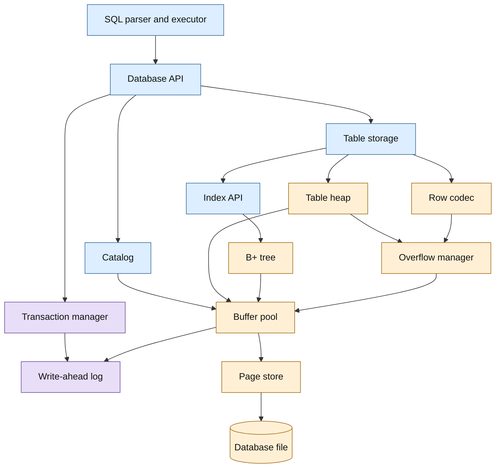
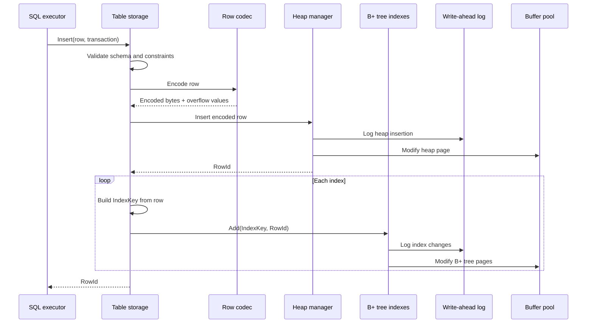
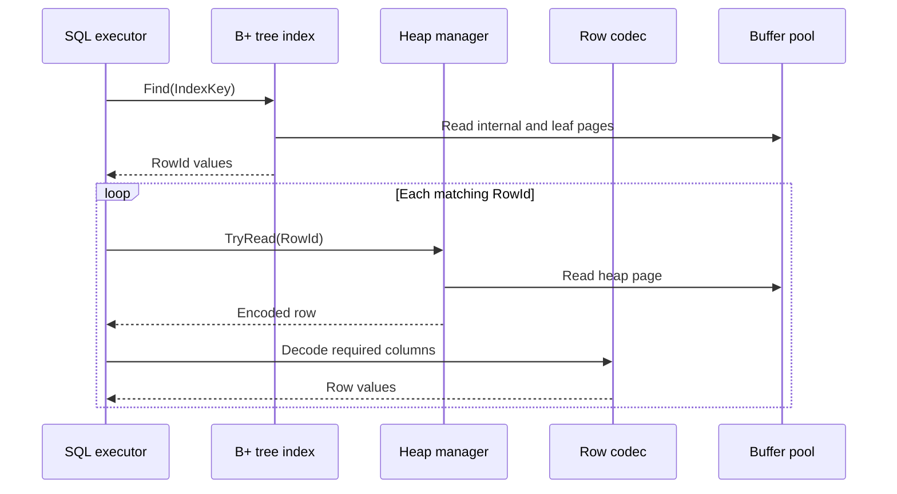
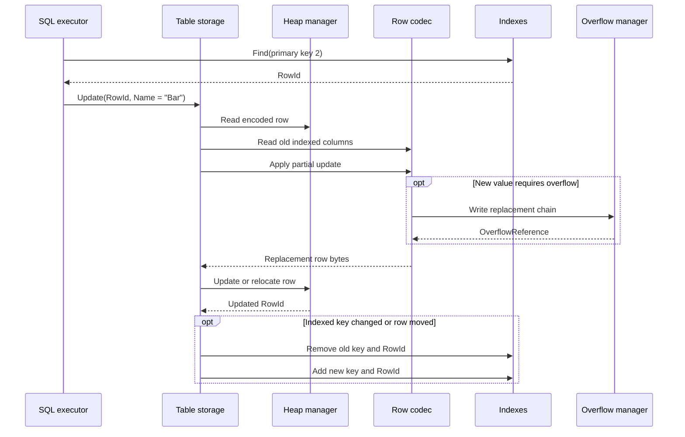
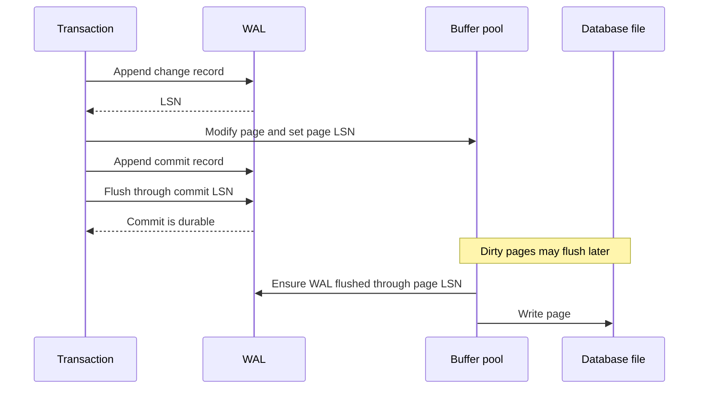

# SQL Storage Engine Plan

## 1. Purpose

This document describes a small but credible SQL storage engine built around:

- Heap-organized tables containing encoded rows.
- B+ tree indexes mapping SQL keys to physical row identifiers.
- Fixed-size pages managed through a buffer pool.
- Overflow-page chains for values that are too large to store inline.
- A catalog containing table, column, and index definitions.
- Transactions and write-ahead logging for atomicity and crash recovery.

The goal is to make each component independently understandable and testable while keeping the first implementation small enough to complete.

### Production profile

“Production grade” in this plan means a single-node embedded or server-local storage engine with:

- Durable commits on supported filesystems and operating systems.
- Atomic recovery from process termination, operating-system failure, and power loss.
- Concurrent transactions with documented isolation semantics.
- Online backups and point-in-time recovery.
- Bounded resource usage and actionable operational telemetry.
- Versioned on-disk formats with tested upgrade and rollback procedures.
- Defensive handling of malformed, truncated, or corrupted storage.

It does not initially mean distributed consensus, synchronous replicas, automatic sharding, or zero-downtime cross-version clusters. Those are separate product capabilities, not prerequisites for a reliable single-node engine.

## 2. Architectural overview



The SQL executor works with databases, tables, rows, and indexes. It does not manipulate B+ tree nodes, page offsets, or log records directly.

## 3. Fundamental identifiers

Identifiers should be small value types rather than raw integers. This prevents accidentally passing an index ID where a page ID is expected.

```csharp
public readonly record struct DatabaseId(Guid Value);
public readonly record struct TableId(ulong Value);
public readonly record struct IndexId(ulong Value);
public readonly record struct PageId(ulong Value);
public readonly record struct TransactionId(ulong Value);
public readonly record struct LogSequenceNumber(ulong Value);
public readonly record struct SlotId(ushort Value);
public readonly record struct SlotGeneration(uint Value);

public readonly record struct RowId(
    PageId PageId,
    SlotId SlotId,
    SlotGeneration Generation);
```

`DatabaseId` is a GUID because it must distinguish database files globally when validating WAL, backups, and restored copies. Page, table, index, transaction, and log identifiers are dense engine-assigned numbers and therefore use unsigned integer wrappers rather than GUIDs. Page zero is valid and contains the database header. Optional references use nullable identifiers rather than sentinel values.

The generation protects against stale identifiers:

1. A row occupies page 10, slot 4, generation 2.
2. The row is deleted.
3. Slot 4 is reused for another row and its generation becomes 3.
4. An old `RowId(10, 4, 2)` is rejected rather than resolving to the new row.

## 4. Public storage API

The SQL execution layer should depend on logical interfaces:

```csharp
public interface IStorageEngine : IDisposable
{
    IDatabase CreateDatabase(string name);
    IDatabase OpenDatabase(string name);
    bool DropDatabase(string name);
}

public interface IDatabase : IDisposable
{
    ICatalog Catalog { get; }

    ITransaction BeginTransaction(
        IsolationLevel isolationLevel = IsolationLevel.ReadCommitted);

    ITable CreateTable(
        TableDefinition definition,
        ITransaction transaction);

    ITable OpenTable(
        string name,
        ITransaction transaction);

    bool DropTable(
        string name,
        ITransaction transaction);

    IIndex CreateIndex(
        IndexDefinition definition,
        ITransaction transaction);

    bool DropIndex(
        string name,
        ITransaction transaction);

    void Flush();
}
```

The table layer coordinates heap and index changes:

```csharp
public interface ITable
{
    TableDefinition Definition { get; }

    RowId Insert(Row row, ITransaction transaction);

    bool TryGet(
        RowId rowId,
        ITransaction transaction,
        out Row row);

    UpdateResult Update(
        RowId rowId,
        RowUpdate update,
        ITransaction transaction);

    bool Delete(
        RowId rowId,
        ITransaction transaction);

    IEnumerable<RowEntry> Scan(
        TableScanOptions options,
        ITransaction transaction);
}
```

Indexes map encoded logical keys to row locations:

```csharp
public interface IIndex
{
    IndexDefinition Definition { get; }

    void Add(
        IndexKey key,
        RowId rowId,
        ITransaction transaction);

    bool Remove(
        IndexKey key,
        RowId rowId,
        ITransaction transaction);

    IEnumerable<RowId> Find(
        IndexKey key,
        ITransaction transaction);

    IEnumerable<IndexEntry> Scan(
        IndexRange range,
        ITransaction transaction);
}
```

The current `IBPlusTree<TKey, TValue>` can implement the data-structure portion of `IIndex`. A persistent index will use:

```csharp
IBPlusTree<IndexKey, RowId>
```

## 5. Database file

The first implementation can use one file per database:

```text
┌────────────────────────────────────┐
│ Page 0: database header            │
├────────────────────────────────────┤
│ Catalog pages                      │
├────────────────────────────────────┤
│ Heap pages                         │
├────────────────────────────────────┤
│ B+ tree pages                      │
├────────────────────────────────────┤
│ Overflow pages                     │
├────────────────────────────────────┤
│ Free pages                         │
└────────────────────────────────────┘
```

Every page has the same size, initially 8 KiB or 16 KiB. A fixed size makes addressing simple:

```text
file offset = page ID × page size
```

The write-ahead log should be a separate append-only file so it can be flushed independently of database pages.

## 6. Common page header

Every page begins with a common header:

```csharp
public enum PageType : byte
{
    DatabaseHeader,
    Catalog,
    Heap,
    BPlusTreeInternal,
    BPlusTreeLeaf,
    Overflow,
    Free
}

public readonly record struct PageHeader(
    PageId PageId,
    PageType PageType,
    LogSequenceNumber PageLogSequenceNumber,
    uint Checksum,
    ushort FormatVersion);
```

The header provides:

- Type validation before decoding a page.
- Format migration through `FormatVersion`.
- Crash recovery through the page log sequence number.
- Corruption detection through a checksum.

## 7. Database header

Page zero has a fixed format:

```csharp
public sealed record DatabaseHeader(
    uint MagicNumber,
    ushort FormatVersion,
    int PageSize,
    PageId CatalogRootPageId,
    PageId FreePageListPageId,
    long NextTableId,
    long NextIndexId,
    long NextTransactionId);
```

Opening a database performs:

1. Read page zero without consulting the catalog.
2. Validate its magic number, version, page size, and checksum.
3. Locate the catalog and free-page structures.
4. Run log recovery if the database was not closed cleanly.
5. Construct table and index handles from catalog records.

## 8. Page allocation

```csharp
public interface IPageStore
{
    PageId Allocate(PageType pageType);
    Page Read(PageId pageId);
    void Write(Page page);
    void Free(PageId pageId);
    void Flush();
}
```

Allocation initially uses a persisted free-page linked list:

```text
Database header
      │
      ▼
Free page 40 → Free page 72 → Free page 103
```

If the free list is empty, allocation extends the database file. A freed page is not reusable until the transaction that freed it can no longer roll back and no reader can still observe it.

## 9. Buffer pool

All table, index, catalog, and overflow access passes through the buffer pool:

```csharp
public interface IBufferPool
{
    IPinnedPage Get(PageId pageId);
    IPinnedPage Allocate(PageType pageType);
    void Flush(PageId pageId);
    void FlushAll();
}

public interface IPinnedPage : IDisposable
{
    PageId PageId { get; }
    Span<byte> Bytes { get; }
    void MarkDirty(LogSequenceNumber logSequenceNumber);
}
```

Pinning prevents a page from being evicted while an operation uses it. Disposing the handle unpins it.

Each buffer frame tracks:

- Page ID.
- Page bytes.
- Pin count.
- Dirty state.
- Most recent log sequence number.
- Replacement-policy metadata.
- A short-lived page latch.

The first replacement policy can be least recently used or clock. Correct pinning is more important than choosing an advanced policy.

## 10. Heap pages

A heap-organized table stores rows without requiring physical key order.

```text
┌────────────────────────────────────┐
│ Heap-page header                   │
│ - page ID                          │
│ - previous/next heap page          │
│ - free-space boundaries            │
│ - slot count                       │
├────────────────────────────────────┤
│ Slot 0: offset, length, generation │
│ Slot 1: deleted                    │
│ Slot 2: offset, length, generation │
├──────────── free space ────────────┤
│ Encoded row 2                      │
│ Encoded row 0                      │
└────────────────────────────────────┘
```

Rows grow backward from the end of the page while the slot directory grows forward. The free region lies between them.

The heap-page API should operate on encoded bytes:

```csharp
public interface IHeapPage
{
    int FreeBytes { get; }

    bool TryInsert(
        ReadOnlySpan<byte> row,
        out ushort slotId,
        out ushort generation);

    bool TryRead(
        ushort slotId,
        ushort generation,
        out ReadOnlyMemory<byte> row);

    HeapUpdateResult Update(
        ushort slotId,
        ushort generation,
        ReadOnlySpan<byte> row);

    bool Delete(
        ushort slotId,
        ushort generation);

    void Compact();
}
```

## 11. Free-space map

The table heap needs to find a page with sufficient space without scanning the entire table:

```csharp
public interface IFreeSpaceMap
{
    PageId? FindPage(int requiredBytes);
    void Update(PageId pageId, int freeBytes);
    void Remove(PageId pageId);
}
```

The MVP can keep this map in memory and reconstruct it by scanning heap-page headers when opening the database. Persistence can be added later.

## 12. Row format

The row codec should be independent of heap pages:

```csharp
public interface IRowCodec
{
    byte[] Encode(Row row, TableDefinition table);
    Row Decode(ReadOnlySpan<byte> bytes, TableDefinition table);

    byte[] ApplyUpdate(
        ReadOnlySpan<byte> currentRow,
        RowUpdate update,
        TableDefinition table);
}
```

A useful row layout is:

```text
┌────────────────────────────────────┐
│ Row format version                 │
│ Column count                       │
│ Null bitmap                        │
│ Variable-column offset table       │
│ Fixed-width column bytes           │
│ Variable-width column bytes        │
│ Inline or overflow descriptors     │
└────────────────────────────────────┘
```

The offset table allows one variable-length field to be located without decoding every other value. A partial update still may need to move bytes or rewrite the encoded row, but callers only provide changed columns:

```csharp
public sealed record RowUpdate(
    IReadOnlyList<ColumnUpdate> Columns);

public readonly record struct ColumnUpdate(
    int ColumnIndex,
    SqlValue Value);
```

## 13. Overflow pages

Small values remain inline. Large values use an exclusively owned overflow chain:

```text
Heap row
┌─────────────────────────────┐
│ Storage kind: Overflow      │
│ Total length: 25,000 bytes  │
│ First page: 81              │
└─────────────────────────────┘
              │
              ▼
Page 81 → Page 82 → Page 90 → null
```

```csharp
public readonly record struct OverflowReference(
    PageId FirstPageId,
    long TotalLength);

public interface IOverflowManager
{
    OverflowReference Write(ReadOnlySpan<byte> value);
    byte[] Read(OverflowReference reference);
    void Free(OverflowReference reference);
}
```

Updates should initially use copy-on-write:

1. Allocate and write a complete replacement chain.
2. Change the row to reference the replacement.
3. Commit the transaction.
4. Reclaim the previous chain when safe.

The reader must validate:

- Every page has type `Overflow`.
- The chain has no cycles.
- The accumulated bytes equal `TotalLength`.
- A missing next page is reported as corruption.

## 14. Page-based B+ tree

The current in-memory B+ tree provides the algorithm, but durable nodes must become pages.

Internal page:

```text
┌───────────────────────────────────┐
│ Header                            │
│ Parent page ID                    │
│ Child 0                           │
│ Separator 0, Child 1              │
│ Separator 1, Child 2              │
└───────────────────────────────────┘
```

Leaf page:

```text
┌───────────────────────────────────┐
│ Header                            │
│ Parent page ID                    │
│ Previous and next leaf page IDs   │
│ Key 0, RowId 0                    │
│ Key 1, RowId 1                    │
└───────────────────────────────────┘
```

Internal pages contain only routing keys. Leaf pages contain:

```csharp
BTreeEntry<IndexKey, RowId>
```

The catalog persists the root page ID. Splitting or contracting the root must update the catalog in the same transaction.

### Required invariants

- Keys are ordered according to the index comparer.
- Every internal node has one more child than separator.
- Every non-root node satisfies minimum occupancy.
- All leaves have the same depth.
- Separator `i` equals the minimum key under child `i + 1`.
- Previous and next leaf links agree.
- Every `RowId` points to a live row of the indexed table.
- A unique index contains at most one entry for each logical key.

## 15. SQL index keys

Indexes require composite values rather than a single primitive:

```csharp
public sealed record IndexKey(
    IReadOnlyList<SqlValue> Values);

public sealed record IndexedColumn(
    int ColumnIndex,
    SortDirection Direction,
    NullSortOrder NullSortOrder,
    CollationId? Collation);
```

Comparison must define:

- How `NULL` sorts.
- Ascending and descending fields.
- Numeric comparisons.
- Text collation.
- Composite-key comparison from first column to last.

Prefer an order-preserving binary encoding. It allows leaf and internal pages to compare serialized keys without materializing every `SqlValue`.

## 16. Catalog

The catalog is authoritative metadata:

```csharp
public sealed record TableDefinition(
    TableId Id,
    string Name,
    IReadOnlyList<ColumnDefinition> Columns,
    PageId FirstHeapPageId);

public sealed record IndexDefinition(
    IndexId Id,
    string Name,
    TableId TableId,
    IReadOnlyList<IndexedColumn> Columns,
    bool IsUnique,
    PageId RootPageId);
```

It records:

- Tables and columns.
- Column types and nullability.
- Heap-page entry points.
- Index definitions and root pages.
- Schema versions.

Use a fixed bootstrap schema for the catalog so the engine can decode it before loading user metadata.

## 17. Insert flow



The table layer owns coordination. The SQL executor should not separately update each index.

## 18. Indexed read flow



Catalog metadata is normally loaded and cached when the table is opened. It is not fetched for every row.

## 19. Partial update flow

For:

```sql
UPDATE Foo SET Name = 'Bar' WHERE Id = 2;
```



If the row moves, all indexes containing its `RowId` must be updated. A later design can preserve stable row IDs through forwarding records.

## 20. Delete flow

A deletion is a coordinated operation:

1. Read columns required to reconstruct every index key.
2. Remove `(IndexKey, RowId)` from every index.
3. Mark the heap slot deleted and increment its generation.
4. Schedule owned overflow chains for reclamation.
5. Update free-space information.
6. Commit all changes atomically.

Physical space should not be reused until rollback and active-reader requirements permit it.

## 21. Transactions

Start with:

- Many concurrent readers.
- A single writer.
- Atomic commit and rollback.
- Read committed isolation.

```csharp
public interface ITransaction : IDisposable
{
    TransactionId Id { get; }
    TransactionState State { get; }
    void Commit();
    void Rollback();
}
```

Disposing an active transaction rolls it back.

The transaction tracks:

- Log records it generated.
- Pages it allocated or freed.
- Overflow chains it replaced.
- Locks it owns.
- Its commit or rollback state.

## 22. Write-ahead logging

The central durability rule is:

> The log record describing a page change must reach durable storage before the changed page reaches durable storage.



Useful log records include:

- Transaction begin, commit, and rollback.
- Page allocation and freeing.
- Heap insertion, update, and deletion.
- B+ tree insertion, deletion, split, merge, and root change.
- Overflow-chain creation and retirement.
- Catalog changes.

For an MVP, physical before-and-after byte ranges are easier to recover than highly logical operations.

## 23. Crash recovery

On startup:

1. Read the database header.
2. Scan the WAL from the latest checkpoint.
3. Identify committed and incomplete transactions.
4. Redo changes whose log sequence number is newer than the page.
5. Undo incomplete transactions.
6. Reconcile allocated and retired pages.
7. Write a checkpoint.

Recovery must be idempotent: running it again after another crash produces the same valid result.

## 24. Concurrency

Two different mechanisms are needed:

- **Transaction locks** protect logical rows, keys, or tables for the duration of a transaction.
- **Page latches** protect in-memory page bytes during a short operation.

The MVP can use:

- A shared database lock for readers.
- An exclusive database lock for the single writer.
- Per-buffer-frame latches internally.

Do not hold a page latch while waiting for a transaction lock; this avoids a common source of deadlocks.

Logical locks use three modes with this compatibility table. `S` is shared, `U` is update, and `X` is exclusive:

| Held/requested | S | U | X |
|---|---:|---:|---:|
| S | Yes | Yes | No |
| U | Yes | No | No |
| X | No | No | No |

Update locks allow readers to continue while ensuring only one prospective writer exists. Locks may be upgraded
from `S` to `U` or `X`, and from `U` to `X`; equal-mode conversion is idempotent. Downgrades are intentionally
rejected because transaction locks are retained at their strongest acquired mode until release. Lock resources use
typed table, row, index, and range identifiers. Acquisition and conversion are cancellation-safe, and ownership is
always attributed to the requesting `TransactionId` until explicit or transaction-wide release.

Each resource has a FIFO request queue. Once a request must wait, later compatible acquisitions do not bypass it.
Conversions retain their already-granted mode and take their normal position in that queue. Commit, rollback,
failure, and disposal release every lock attributed to the transaction; cancelling a waiter removes it before later
requests are reconsidered.

Blocked requests form a wait-for graph containing incompatible holders and earlier FIFO waiters. Cycle detection
runs whenever a request remains blocked. The transaction with the greatest `TransactionId` in the detected cycle is
the deterministic victim: it is rolled back, its pins and locks are released, and its blocked operation receives a
`DeadlockException`. The manager exposes the resolved-deadlock count and most recent victim identifier for
diagnostics. Acyclic waits remain queued and are not counted.

Read-committed row reads take a shared lock only for the physical read, so a later read in the same transaction may
observe a newer committed value. Repeatable-read retains shared row locks until transaction completion; mutations
take exclusive row locks and also retain them to prevent lost updates. A relocated update retains the old-row lock
and immediately locks the returned `RowId`. Table scans apply the same policy row by row: read-committed releases
each row after decoding, while repeatable-read retains every visited row lock. Serializable scans additionally use
the index-range rules described below; row locks alone do not prevent phantoms.

Serializable index scans retain a shared range lock through transaction completion. Insert and delete operations
take exclusive key intent, which conflicts with every retained range containing that key. Two finite ranges overlap
at an equal endpoint only when both include it, matching `IndexRange`/`BTreeRange` scan semantics. Null lower or
upper endpoints mean negative or positive infinity and their inclusion flags are ignored. Equal finite endpoints
form an empty range when either endpoint is excluded; empty ranges conflict with no key or range. Overlapping
resources participate in the same global FIFO ordering and wait-for graph, while non-overlapping ranges proceed
independently.

## 25. Failure cases that must remain safe

The design must account for failures:

- After the heap row is written but before indexes are updated.
- During a B+ tree split.
- After writing a new overflow chain but before linking it.
- After linking a new overflow chain but before retiring the old chain.
- While changing an index root page in the catalog.
- During page compaction.
- While flushing only some dirty pages.

WAL and transactions should make each case recover to either the state before the transaction or the fully committed state.

## 26. Integrity checking

```csharp
public interface IIntegrityChecker
{
    IntegrityReport CheckDatabase();
    IntegrityReport CheckTable(TableId tableId);
    IntegrityReport CheckIndex(IndexId indexId);
}
```

Checks should include:

- Page checksum and expected page type.
- Valid offsets, lengths, and slot generations.
- No allocated page appears on the free list.
- Every reachable page is allocated.
- No overflow-chain cycles.
- B+ tree ordering, occupancy, separators, depth, and leaf links.
- Every index `RowId` resolves to a live row.
- Every table row has required index entries.
- Unique indexes contain no duplicate logical keys.

## 27. Suggested project structure

```text
sql-storage-engine/
├── Api/
│   ├── IStorageEngine.cs
│   ├── IDatabase.cs
│   ├── ITable.cs
│   └── IIndex.cs
├── Catalog/
│   ├── Catalog.cs
│   └── Definitions.cs
├── Pages/
│   ├── Page.cs
│   ├── PageHeader.cs
│   ├── PageStore.cs
│   └── PageAllocator.cs
├── Buffering/
│   ├── BufferPool.cs
│   └── PinnedPage.cs
├── Heap/
│   ├── HeapPage.cs
│   ├── TableHeap.cs
│   └── FreeSpaceMap.cs
├── Rows/
│   ├── RowCodec.cs
│   └── SqlValue.cs
├── Overflow/
│   └── OverflowManager.cs
├── Indexes/
│   ├── BPlusTree.cs
│   ├── BPlusTreePages.cs
│   └── IndexKeyCodec.cs
├── Transactions/
│   ├── Transaction.cs
│   ├── TransactionManager.cs
│   └── LockManager.cs
├── Logging/
│   ├── WriteAheadLog.cs
│   ├── LogRecord.cs
│   └── RecoveryManager.cs
└── Diagnostics/
    └── IntegrityChecker.cs
```

Keep page codecs separate from page behavior. This allows algorithms to be tested using strongly typed page objects while serialization receives focused binary-format tests.

## 28. Implementation phases

### Phase 1: Page foundation

1. Define `PageId`, page size, common headers, and page types.
2. Implement a file-backed `IPageStore`.
3. Add allocation, freeing, and database header creation.
4. Add checksums and format validation.
5. Test reopening and page reuse.

### Phase 2: Buffer pool

1. Implement pin/unpin semantics.
2. Track dirty pages.
3. Add a clock or LRU replacement policy.
4. Ensure pinned pages cannot be evicted.
5. Test forced eviction and dirty-page flushing.

### Phase 3: Heap and rows

1. Implement slotted heap pages.
2. Define the row binary format.
3. Implement insert, read, delete, and compaction.
4. Add `RowId` generations.
5. Add a simple free-space map.
6. Implement partial encoded-row updates.

### Phase 4: Overflow storage

1. Define inline and overflow descriptors.
2. Implement write, read, and free.
3. Add copy-on-write replacement.
4. Detect broken and cyclic chains.
5. Integrate overflow references into the row codec.

### Phase 5: Persistent B+ tree

1. Convert in-memory nodes to internal and leaf page codecs.
2. Replace object references with `PageId`.
3. Persist leaf sibling links.
4. Persist and update the root page ID.
5. Port randomized insertion/deletion invariants to page-backed tests.
6. Test reopening trees after every structural operation.

### Phase 6: Catalog and tables

1. Implement fixed bootstrap catalog records.
2. Persist table and index definitions.
3. Create table heaps.
4. Coordinate heap and index operations in `ITable`.
5. Implement secondary-index construction from a table scan.

### Phase 7: Transactions and recovery

1. Add transaction identifiers and states.
2. Implement WAL append and flush.
3. Log page changes.
4. Implement commit, rollback, redo, and undo.
5. Add checkpoints.
6. Add crash-injection tests at every write boundary.

### Phase 8: Concurrency and maintenance

1. Add many-reader/single-writer locking.
2. Add page latches.
3. Add deferred reclamation.
4. Add integrity checks.
5. Add heap compaction and orphan cleanup.

### Phase 9: Multi-writer isolation

1. Add strict two-phase locking.
2. Define and test read committed behavior.
3. Add deadlock detection, timeouts, and cancellation.
4. Add repeatable read and serializable key-range locking.
5. Add concurrent randomized history tests.
6. Publish lock, latch, and resource-ordering rules.

### Phase 10: Operational lifecycle

1. Add offline and online physical backups.
2. Add WAL archival and point-in-time recovery.
3. Add backup manifests and automatic restore verification.
4. Add golden format fixtures and restartable upgrades.
5. Add interruptible maintenance and WAL-retention management.
6. Add structured metrics and diagnostic commands.

### Phase 11: Production qualification

1. Implement torn-page protection.
2. Qualify flush behavior on every supported platform.
3. Complete crash, torn-write, disk-full, and short-I/O matrices.
4. Fuzz all persistent decoders.
5. Run long-duration soak and recovery tests.
6. Document capacity limits and performance objectives.
7. Rehearse backup, restore, upgrade, rollback, and incident runbooks.

## 29. Testing strategy

Each layer should be testable without higher layers:

- **Page store:** allocate, write, close, reopen, read, free, reuse.
- **Buffer pool:** eviction, pin protection, dirty flush, concurrent access.
- **Heap page:** boundary-sized rows, slot reuse, compaction, stale `RowId`.
- **Row codec:** every SQL type, nulls, malformed input, partial updates.
- **Overflow:** zero length, one page, many pages, cycles, truncation.
- **B+ tree:** randomized operations, duplicate keys, root changes, reopen.
- **Catalog:** create/drop/reopen and schema version decoding.
- **Transactions:** rollback at every operation boundary.
- **Recovery:** terminate after each log or page write, then reopen.
- **Integration:** compare randomized SQL-like operations with an in-memory model.

Property-based tests are particularly useful for the heap and B+ tree. Crash testing should deliberately stop the engine between WAL flushes and page writes.

## 30. Initial simplifications

Use these constraints to keep the first version achievable:

- One database file and one WAL file.
- Fixed page size.
- One writer at a time.
- No MVCC.
- No row forwarding initially; relocation returns a new `RowId`.
- No overflow-page sharing.
- Complete replacement of overflow values.
- In-memory free-space map reconstructed on startup.
- Fixed-format catalog bootstrapping.
- Full row decoding before predicate evaluation.
- Physical WAL records rather than optimized logical logging.

These choices preserve the important architecture without prematurely adding sophisticated optimization.

## 31. Definition of a viable first storage engine

The first meaningful milestone should be able to:

1. Create and reopen a database.
2. Create a table and persist its schema.
3. Insert, read, partially update, delete, and scan rows.
4. Store large values using overflow pages.
5. Create and maintain a page-backed B+ tree index.
6. Find heap rows through `IndexKey → RowId`.
7. Keep heap and index changes atomic.
8. Recover committed transactions after a forced process termination.
9. Roll back incomplete transactions.
10. Pass an integrity check after randomized and crash-injection tests.

At that point the project is no longer only a collection of data structures. It is a durable storage engine on which a SQL planner and executor can safely depend.

## 32. Durability contract and platform assumptions

A production engine must publish exactly what `Commit` guarantees. The proposed contract is:

> After `Commit` returns successfully, the transaction remains committed after process termination, operating-system failure, or power loss, provided the storage device and filesystem honor the documented flush contract.

The implementation must define and test:

- Which operating systems and filesystems are supported.
- Whether buffered, direct, or memory-mapped I/O is used.
- How data and WAL files are flushed.
- Whether parent directories are flushed after file creation, rename, or deletion.
- Whether sector writes are assumed atomic and at what size.
- How short reads, short writes, interrupted system calls, and disk-full errors are handled.
- Whether storage on network filesystems is supported.
- The behavior when a device acknowledges a flush without preserving data.

Do not claim durability on an untested platform. Keep a compatibility matrix containing operating system, filesystem, page size, sector size, and storage configuration.

### Commit sequence

1. Append all transaction log records.
2. Append the commit record.
3. Flush the WAL through the commit record.
4. Report success to the caller.
5. Flush dirty database pages later, while enforcing WAL-before-data ordering.

If WAL flushing fails, `Commit` fails and must not report an ambiguous success. If the process loses contact with the caller after the flush but before returning, the transaction may be committed; callers need idempotency at a higher layer when retrying.

## 33. Torn-page and partial-write protection

WAL alone does not necessarily protect a page whose physical write is torn and whose page LSN suggests recovery does not need to redo it.

Choose and document one initial protection strategy:

### Recommended: full-page images after checkpoints

- Log a full before- or after-image the first time a page changes after a checkpoint.
- During recovery, replace a torn page from the full-page image before applying later records.
- Retain per-page checksums to detect the torn page.

### Alternative: double-write area

- Write complete page images to a protected staging area.
- Flush the staging area.
- Write pages to their final locations.
- Recover damaged final pages from the staging copy.

Every page read must verify:

- Page ID matches the requested address.
- Page type is expected.
- Format version is supported.
- Header and payload lengths are valid.
- Checksum is correct.

A checksum failure is a corruption event. The engine must not silently rewrite the page unless recovery has a verified source from which to reconstruct it.

## 34. WAL lifecycle and point-in-time recovery

The WAL needs lifecycle management beyond basic redo and undo:

- Segment files with monotonically ordered identifiers.
- Checksums for record headers and payloads.
- Explicit record length and previous-record linkage.
- Safe handling of incomplete trailing records.
- Checkpoints that record active transactions and dirty pages.
- Retention rules based on checkpoints, backups, and replicas.
- Segment recycling or deletion only when no recovery consumer needs them.
- A timeline or database incarnation identifier after point-in-time recovery.

Point-in-time recovery works by:

1. Restoring a consistent base backup.
2. Replaying archived WAL in order.
3. Stopping at a target timestamp or log sequence number.
4. Writing a new timeline marker so old WAL cannot be accidentally appended.

WAL replay must validate database identity and timeline before changing pages.

## 35. Backup and restore

A production engine requires a tested restore path, not merely a backup command.

```csharp
public interface IBackupManager
{
    BackupManifest CreateBackup(
        Stream destination,
        ITransaction transaction);

    void RestoreBackup(
        Stream source,
        string destinationPath);

    BackupVerificationResult VerifyBackup(Stream source);
}
```

The initial supported backup types should be:

- **Offline backup:** database closed cleanly; copy database and required WAL.
- **Online physical backup:** establish a backup LSN, copy pages while writes continue, then retain WAL needed to make the copy consistent.

Every backup includes a manifest with:

- Database identity.
- Format version.
- Page size.
- Start and end LSN.
- Required WAL segments.
- File sizes and checksums.
- Creation time and engine version.

Production acceptance requires automated restore tests. A backup that has not been restored and integrity-checked is not considered verified.

Offline backups require the database header's clean-shutdown marker. Files are copied into a new directory under
fixed engine-assigned names and described by a bounded JSON manifest containing database identity, format and page
size, WAL LSN bounds, UTC creation time, engine version, byte sizes, and SHA-256 checksums. Verification rereads
every file independently. Restore always targets a new directory, revalidates the manifest and checksums, then opens
the copied database and validates every allocated page header and checksum before reporting success.

## 36. Transaction isolation and concurrency model

The final concurrency design must specify observable SQL behavior, not only locks.

At minimum define:

- Read phenomena allowed by each isolation level.
- Whether readers block writers or writers block readers.
- Lock acquisition and release points.
- Deadlock detection and victim selection.
- Timeout and cancellation behavior.
- Range or predicate locking for phantom prevention.
- Behavior of scans when rows move or pages split.

Recommended evolution:

1. Many readers and one writer with read committed behavior.
2. Multiple writers using strict two-phase locking.
3. Add repeatable read.
4. Add serializable behavior with key-range locks.
5. Evaluate MVCC only after workload evidence justifies it.

Strict two-phase locking retains write locks until commit or rollback. Page latches remain short-lived implementation locks and must not be held while waiting for transaction locks.

The lock manager needs:

- A stable lock ordering where possible.
- A wait-for graph or timeout-based deadlock policy.
- Cancellation-safe waiter removal.
- Metrics for waits, timeouts, and deadlocks.
- Tests that force every lock-order interaction.

## 37. Resource governance and failure containment

All untrusted or workload-controlled sizes require limits:

- Maximum database, table, row, key, and value size.
- Maximum column and index count.
- Maximum transaction log growth.
- Maximum pinned pages per operation.
- Maximum transaction duration and undo volume.
- Maximum overflow-chain length.
- Maximum concurrent scans and transactions.
- Maximum recursion or tree height accepted from disk.

APIs should accept cancellation where operations may block or scan substantial data:

```csharp
IEnumerable<RowEntry> Scan(
    TableScanOptions options,
    ITransaction transaction,
    CancellationToken cancellationToken);
```

Disk-full, quota, out-of-memory, cancellation, and I/O failures must:

- Leave the current transaction abortable.
- Release latches, locks, pins, and file handles.
- Avoid publishing partially initialized pages.
- Preserve enough WAL to recover.
- Produce a stable error category with context.

## 38. Security and trust boundaries

Even an embedded engine processes potentially malformed database and WAL files.

Required protections include:

- Bounds-check every offset and length before slicing page bytes.
- Use checked arithmetic for sizes, offsets, and page calculations.
- Cap allocations derived from file content.
- Reject cycles and impossible graph depth.
- Never deserialize arbitrary runtime types from storage.
- Avoid leaking row values, keys, or credentials in ordinary logs.
- Use least-privilege file permissions when creating database and WAL files.
- Define secure temporary-file creation for backup and recovery.
- Fuzz page, row, key, catalog, overflow, WAL, and backup decoders.

Encryption at rest can be deferred, but the format should reserve identifiers for checksum and encryption algorithms. If encryption is added, authentication must cover page identity and metadata as well as payload bytes.

## 39. Schema and format evolution

There are two separate compatibility concerns:

### Physical file-format compatibility

- Every persistent structure has a format version.
- Readers reject unknown future versions.
- Upgrade steps are explicit and restartable.
- Upgrade does not destroy the last recoverable copy.
- Downgrade support is stated rather than assumed.

### Logical schema evolution

The catalog must eventually support:

- Adding nullable columns without rewriting every row.
- Column defaults.
- Renaming logical objects without changing their IDs.
- Rebuilding indexes.
- Tracking the schema version used to encode a row.

Use stable numeric table, column, and index IDs internally. Names are catalog attributes and can change.

A released format requires golden files checked into test fixtures. Every supported engine version must open the fixtures it claims to support.

## 40. Maintenance and space reclamation

Normal use creates fragmentation and retired storage. Production maintenance includes:

- Heap-page compaction.
- Free-space map correction.
- B+ tree page merging and index rebuild.
- Deferred page reuse.
- Overflow orphan detection and reclamation.
- WAL checkpointing and retention.
- Catalog statistics refresh.
- Optional database compaction into a new file.

Maintenance operations must be:

- Interruptible.
- Restartable.
- Transactionally safe.
- Rate limited so foreground work can continue.
- Observable through progress and error reporting.

Avoid in-place whole-file rewrites for the first compaction implementation. Build a replacement file, validate it, flush it, and atomically switch only where the platform contract supports that sequence.

## 41. Observability and diagnostics

Expose structured metrics rather than requiring log parsing:

- Buffer hit and miss counts.
- Dirty and pinned frame counts.
- Page reads, writes, and flush latency.
- WAL bytes, flush count, and flush latency.
- Transaction commits, rollbacks, waits, timeouts, and deadlocks.
- Heap live/dead bytes and fragmentation.
- B+ tree height, page occupancy, splits, merges, and scan pages.
- Overflow values, bytes, and orphan count.
- Checkpoint duration and recovery distance.
- Backup age, duration, size, and verification result.

Logs should include database ID, transaction ID, page ID, index ID, and LSN where relevant, but exclude user values by default.

Diagnostic commands should support:

- Database and file-format information.
- Page-header inspection.
- Table and index size summaries.
- Integrity check with stable machine-readable findings.
- WAL and checkpoint status.
- Backup and restore status.

## 42. Production verification matrix

Production readiness requires evidence across multiple test classes:

| Test class | Required evidence |
|---|---|
| Unit | Boundary behavior for every page and record codec |
| Model/property | Heap and B+ tree agree with simple reference models |
| Reopen | Every persistent mutation survives close and reopen |
| Crash | Forced termination at every durable write boundary |
| Torn write | Partial page and WAL writes are detected and recovered |
| Fault injection | Disk full, short I/O, denied flush, allocation failure |
| Concurrency | Linearizable histories or isolation-specific outcomes |
| Fuzz | No crashes or unsafe allocations from malformed files |
| Compatibility | Golden files open across every supported version |
| Backup | Automated backup, restore, replay, and integrity validation |
| Soak | Long randomized workloads with periodic restart and checking |
| Performance | Regression budgets for latency, throughput, and space |

### Mandatory production release gates

- No known data-loss or silent-corruption defects.
- Crash matrix passes on every supported platform/filesystem combination.
- Backup restore and point-in-time recovery pass automatically.
- Integrity checker passes after crash, soak, and upgrade tests.
- Public transaction and durability guarantees are documented.
- All persistent formats are versioned.
- Resource limits and capacity ceilings are documented and enforced.
- Operational metrics and stable error categories are available.
- Upgrade and rollback procedures have been rehearsed.
- Security review and decoder fuzzing have no unresolved critical findings.

Performance results alone cannot waive a correctness gate.
