# SQL Storage Engine User Stories

## 1. Purpose

This backlog translates the product direction in [roadmap.md](roadmap.md) and the architecture in [storage-plan.md](storage-plan.md) into tickets suitable for a junior developer.

Each ticket:

- Has one primary outcome.
- Is intended to fit within one development iteration.
- Has explicit dependencies.
- Includes acceptance criteria that can be demonstrated by tests.
- Contains technical-lead guidance without prescribing every line of code.
- Uses story points to describe relative complexity, not elapsed time.

The tickets are ordered by dependency. A developer should not begin a ticket until its dependencies meet the shared definition of done.

## 2. Roles used in the stories

- **Storage-engine developer:** builds higher-level storage components.
- **SQL executor:** consumes logical table and index APIs.
- **Database operator:** creates, opens, backs up, restores, and diagnoses databases.
- **Application developer:** relies on transaction and durability guarantees.
- **Product maintainer:** supports compatibility and safe releases.

## 3. Story-point guide

| Points | Expected shape |
|---|---|
| 1 | Small, local change with obvious tests |
| 2 | One focused component with limited edge cases |
| 3 | Several related behaviors or a small binary format |
| 5 | Cross-component behavior requiring careful failure tests |

Tickets estimated above five points should be split before refinement. Estimates must be confirmed by the delivery team.

## 4. Definition of ready

A ticket is ready when:

- Its dependencies are complete or explicitly mocked.
- Public names and ownership boundaries are agreed.
- Persistent byte layouts have an approved format note.
- Error behavior is specified.
- Acceptance criteria are testable.
- Any intentionally deferred behavior is listed.

## 5. Definition of done

A ticket is done when:

- Every acceptance criterion passes.
- Unit and integration tests are deterministic.
- The solution builds without warnings.
- Public behavior has XML documentation.
- Non-obvious invariants have intent-focused comments.
- Resource ownership and disposal are tested.
- Relevant design documentation is updated.
- No unrelated files are modified.

## 6. C# and .NET implementation baseline

These decisions apply to every ticket unless that ticket explicitly replaces one through an approved architecture decision record.

### Target framework and language

- Target `.NET 10` and the C# language version selected by the SDK.
- Keep nullable reference types and implicit global usings enabled.
- Treat compiler and analyzer warnings as defects; do not suppress them without a written reason.
- Prefer file-scoped namespaces, collection expressions, pattern matching, and primary constructors only where they improve readability.
- Prefer `sealed` concrete implementation classes unless inheritance is an intentional extension point.
- Public abstractions use interfaces; internal algorithms do not need an interface for every class.

### Identifier types

Identifiers are not interchangeable integers and are not all GUIDs:

| Type | C# representation | Reason |
|---|---|---|
| `DatabaseId` | `readonly record struct` wrapping `Guid` | Globally distinguishes a database and prevents replaying another database’s WAL |
| `PageId` | `readonly record struct` wrapping `ulong` | Dense zero-based physical page number; page zero is the database header |
| `TableId` | `readonly record struct` wrapping `ulong` | Compact catalog-assigned identifier |
| `IndexId` | `readonly record struct` wrapping `ulong` | Compact catalog-assigned identifier |
| `TransactionId` | `readonly record struct` wrapping `ulong` | Monotonically allocated within one database incarnation |
| `LogSequenceNumber` | `readonly record struct` wrapping `ulong` | Monotonic byte/log position; zero means no WAL record |
| `SlotId` | `readonly record struct` wrapping `ushort` | Compact slot-directory index within one page |
| `SlotGeneration` | `readonly record struct` wrapping `uint` | Detects stale `RowId` values with practical wraparound protection |

Use a nullable identifier such as `PageId?` when absence is valid. Do not invent sentinel values such as `-1` or `ulong.MaxValue`.

Example:

```csharp
public readonly record struct PageId
{
    public PageId(ulong value)
    {
        Value = value;
    }

    public ulong Value { get; }

    public override string ToString() => $"page:{Value}";
}

public readonly record struct DatabaseId(Guid Value)
{
    public static DatabaseId New() => new(Guid.NewGuid());
    public override string ToString() => $"database:{Value:D}";
}

public readonly record struct RowId(
    PageId PageId,
    SlotId SlotId,
    SlotGeneration Generation);
```

Do not add implicit numeric conversions. When a raw value is needed for serialization, use `.Value`. This keeps accidental calls such as `ReadPage(new TableId(4))` from compiling.

### Binary formats

- Persistent integers use explicit little-endian encoding through `System.Buffers.Binary.BinaryPrimitives`.
- Never persist C# structs using memory layout, `Marshal`, `BinaryFormatter`, or runtime type serialization.
- Every codec exposes named `EncodedLength`, `Write(Span<byte>, ...)`, and `Read(ReadOnlySpan<byte>)` operations where the record is fixed width.
- Use checked arithmetic for page offsets, lengths, and counts.
- Convert a `PageId` to a file offset with a checked helper:

```csharp
public static long GetPageOffset(PageId pageId, int pageSize)
{
    ArgumentOutOfRangeException.ThrowIfNegativeOrZero(pageSize);
    return checked((long)(pageId.Value * (ulong)pageSize));
}
```

- Store `DatabaseId` as a canonical 16-byte UUID through one dedicated codec and golden-byte tests. Do not rely on the historical mixed-endian result of `Guid.ToByteArray()` without explicitly defining it as the format.

### Buffers and I/O

- Use `ReadOnlySpan<byte>` for synchronous, non-owning input and `Span<byte>` for synchronous output.
- Use `ReadOnlyMemory<byte>`/`Memory<byte>` when data crosses an asynchronous boundary.
- File I/O uses `Microsoft.Win32.SafeHandles.SafeFileHandle` with `RandomAccess.ReadAsync` and `RandomAccess.WriteAsync`; do not share mutable `FileStream.Position`.
- Potentially blocking public operations accept `CancellationToken`.
- Async APIs return `ValueTask` when completion is commonly synchronous and `Task` otherwise; do not use `async void`.
- Pooled buffers obtained from `ArrayPool<byte>` must be returned in `finally`.

### Errors and results

- Invalid caller arguments use standard argument exceptions.
- Expected absence uses `bool`/`Try...` or a documented result type.
- Storage failures use a small explicit exception hierarchy such as `StorageException`, `StorageFormatException`, `StorageCorruptionException`, and `StorageResourceException`.
- Never catch `Exception` merely to return `false`.
- Preserve the original exception as `InnerException` when adding storage context.

### Ownership, threading, and observability

- Types owning file handles, locks, pins, or pooled buffers implement `IDisposable` or `IAsyncDisposable`.
- Disposal is deterministic and tested on success, cancellation, and exceptions.
- Shared mutable collections require an explicit synchronization strategy.
- Do not expose mutable `List<T>`, arrays, spans, or page buffers through public APIs.
- Use `TimeProvider` for testable time and inject I/O abstractions for failure testing.
- Use `System.Diagnostics.Metrics` for metrics and `Microsoft.Extensions.Logging.ILogger<T>` for structured logs.
- Logs include typed IDs and LSNs but exclude row values and index keys by default.

### Testing conventions

- NUnit and AwesomeAssertions remain the default test stack.
- Test names describe the condition and observable result.
- Binary codecs require round-trip, golden-byte, truncation, invalid-value, and boundary tests.
- Persistent components require close/reopen tests.
- Resource-owning components require cancellation and exception-path disposal tests.
- Randomized tests use fixed seeds printed in failure output.

## 7. Backlog dependency map

```mermaid
flowchart LR
    P1[Page identifiers]
    P2[Page header codec]
    P3[Database header codec]
    P4[In-memory page store]
    P5[File page store]
    P6[Page allocator]
    B1[Buffer frames]
    B2[Buffer eviction]
    H1[Heap page layout]
    H2[RowId generations]
    H3[Table heap]
    R1[Row codec]
    O1[Overflow pages]
    I1[Index page codecs]
    I2[Persistent B+ tree]
    C1[Catalog]
    T1[Table coordination]
    X1[Transactions]
    W1[WAL]
    W2[Recovery]
    BK1[Backup and PITR]
    PR1[Production qualification]

    P1 --> P2 --> P3
    P1 --> P4
    P3 --> P5 --> P6
    P4 --> B1
    P5 --> B1 --> B2
    B2 --> H1 --> H2 --> H3
    H1 --> R1
    H3 --> O1
    B2 --> I1 --> I2
    H3 --> C1
    I2 --> C1 --> T1
    R1 --> T1
    O1 --> T1
    T1 --> X1 --> W1 --> W2
    W2 --> BK1 --> PR1
```



# Epic A — Page foundation

## US-PAGE-001 — Add strongly typed storage identifiers

**Story points:** 1  
**Dependencies:** None

### Product objective

Prevent page, table, index, transaction, and log identifiers from being accidentally interchanged.

### User story

As a storage-engine developer, I want strongly typed identifiers so that the compiler detects invalid identifier usage.

### Technical-lead plan

1. Create an `Identifiers` source folder or namespace.
2. Implement `DatabaseId` as `public readonly record struct DatabaseId(Guid Value)` with `DatabaseId.New()` using `Guid.NewGuid()`.
3. Implement `PageId`, `TableId`, `IndexId`, `TransactionId`, and `LogSequenceNumber` as public `readonly record struct` types wrapping `ulong`.
4. Implement `SlotId` over `ushort` and `SlotGeneration` over `uint`.
5. Implement `RowId` as a composite of `PageId`, `SlotId`, and `SlotGeneration`.
6. Override `ToString()` with stable diagnostic prefixes such as `page:42`, `table:3`, and `lsn:1024`.
7. Expose the raw primitive only through a read-only `Value` property.
8. Do not implement implicit or explicit conversion operators between IDs and primitives.
9. Use nullable IDs when absence is valid; do not add sentinel constants.

### Acceptance criteria

- `DatabaseId` wraps `Guid`; `PageId`, `TableId`, `IndexId`, `TransactionId`, and `LogSequenceNumber` wrap `ulong`; `SlotId` wraps `ushort`; and `SlotGeneration` wraps `uint`.
- Each identifier supports value equality and dictionary-key usage.
- Two identifiers with the same underlying number but different types cannot be passed interchangeably.
- `PageId(0)` is valid and reserved for the database header.
- `LogSequenceNumber(0)` means no WAL record; the first real WAL record is greater than zero.
- Absence is represented by nullable IDs rather than sentinel numbers.
- Formatting includes both the identifier kind and value.
- Tests cover equality, inequality, default values, maximum primitive values, nullable absence, and formatting.

### Out of scope

- Allocating identifier values.
- Persisting identifiers.

## US-PAGE-002 — Define page type and common header model

**Story points:** 2  
**Dependencies:** US-PAGE-001

### Product objective

Give every persistent page enough identity and version information to be validated before decoding.

### User story

As a storage component, I want every page to declare its identity and type so that incorrect page access is detected.

### Technical-lead plan

1. Add `public enum PageType : ushort` with explicit numeric values; reserve zero for `Unknown`.
2. Add `public readonly record struct PageFormatVersion(ushort Value)`.
3. Add a `public readonly record struct PageHeader` containing `PageId`, `PageType`, `PageFormatVersion`, `LogSequenceNumber`, checksum algorithm ID, and checksum value.
4. Add `PageConstants.Size` and `PageHeaderCodec.EncodedLength`; do not derive persistent sizes from `sizeof(PageHeader)`.
5. Reserve a documented byte range in the encoded header rather than adding unused C# properties.
6. Add a `PageHeader.Validate(PageId expectedPageId, PageType? expectedType)` method or dedicated validator returning a typed failure.

### Acceptance criteria

- The model contains page ID, page type, format version, page LSN, and checksum.
- Every supported page type has an explicit enumeration value.
- Unknown numeric page types are rejected by validation.
- Header size and field order are documented.
- Tests cover every page type and unsupported values.

## US-PAGE-003 — Implement the common page-header codec

**Story points:** 3  
**Dependencies:** US-PAGE-002

### Product objective

Produce a deterministic binary representation for page headers.

### User story

As a page store, I want to encode and decode page headers so that pages can be persisted consistently.

### Technical-lead plan

1. Add a stateless `internal static class PageHeaderCodec`.
2. Declare `public const int EncodedLength`.
3. Implement `Write(Span<byte> destination, PageHeader header)` using `BinaryPrimitives.WriteUInt16LittleEndian`, `WriteUInt32LittleEndian`, and `WriteUInt64LittleEndian`.
4. Implement `Read(ReadOnlySpan<byte> source)` returning `PageHeader`.
5. Throw `ArgumentException` when a caller-provided destination is too short and `StorageFormatException` when persisted source bytes are truncated or invalid.
6. Write reserved bytes as zero and reject nonzero reserved bytes until a later format version defines them.
7. Keep the checksum field zero while calculating a checksum, then write the final value through the checksum component.

### Acceptance criteria

- A header round trip preserves every field.
- Encoding the same header always produces identical bytes.
- Decoding a short buffer fails without reading out of bounds.
- Unsupported versions and unknown page types fail explicitly.
- Boundary identifier and LSN values round trip.
- Golden expected bytes are asserted in tests.

## US-PAGE-004 — Implement page checksum calculation

**Story points:** 2  
**Dependencies:** US-PAGE-003

### Product objective

Detect accidental page corruption and partial writes.

### User story

As a database operator, I want corrupted pages to be detected before their contents are used.

### Technical-lead plan

1. Define a checksum abstraction so the algorithm can evolve.
2. Calculate over the complete page while treating the checksum field as zero.
3. Add `WriteChecksum` and `ValidateChecksum` operations.
4. Document that detection is not yet recovery.

### Acceptance criteria

- A newly checksummed page validates.
- Changing any tested header or payload byte invalidates the checksum.
- Rewriting the checksum restores validation.
- Pages of the wrong size are rejected.
- The checksum algorithm and identifier are documented.

## US-PAGE-005 — Define and encode the database header

**Story points:** 3  
**Dependencies:** US-PAGE-003, US-PAGE-004

### Product objective

Allow the engine to recognize and bootstrap its own database files.

### User story

As a database operator, I want invalid or incompatible database files rejected safely when opened.

### Technical-lead plan

1. Define magic number, database identity, page size, format version, catalog root, free-list root, and next-ID fields.
2. Implement a fixed page-zero codec.
3. Validate supported page sizes and versions.
4. Include a clean-shutdown or recovery-required marker.

### Acceptance criteria

- A valid header round trips through a page-sized buffer.
- Invalid magic number, checksum, page size, and version produce distinct errors.
- The codec never modifies the input buffer while decoding.
- A golden page-zero fixture is committed to the test project.
- Add `docs/database-file-format.md` containing a byte-offset table for every database-header field, its width, encoding, and validation rule.

## US-PAGE-006 — Create the page-store interface

**Story points:** 1  
**Dependencies:** US-PAGE-001, US-PAGE-002

### Product objective

Decouple page consumers from memory and file I/O.

### User story

As a storage component, I want one page-store contract so that it can run against memory in tests and disk in production.

### Technical-lead plan

Define the initial contract using asynchronous, offset-independent I/O:

```csharp
public interface IPageStore : IAsyncDisposable
{
    int PageSize { get; }

    ValueTask ReadAsync(
        PageId pageId,
        Memory<byte> destination,
        CancellationToken cancellationToken = default);

    ValueTask WriteAsync(
        PageId pageId,
        ReadOnlyMemory<byte> source,
        CancellationToken cancellationToken = default);

    ValueTask FlushAsync(CancellationToken cancellationToken = default);
}
```

Allocation remains a separate `IPageAllocator` because it mutates ownership metadata rather than performing raw I/O. Require exactly `PageSize` bytes for reads and writes. The caller owns supplied memory; the store must not retain it after the returned operation completes.

### Acceptance criteria

- The interface does not expose file offsets.
- Read and write require complete fixed-size pages.
- Flush semantics are documented.
- Ownership and disposal responsibilities are documented.
- Cancellation requirements are documented for blocking operations.

## US-PAGE-007 — Implement the in-memory page store

**Story points:** 3  
**Dependencies:** US-PAGE-006

### Product objective

Enable deterministic page-level development without filesystem dependencies.

### User story

As a test author, I want an in-memory page store so that page consumers can be tested quickly and deterministically.

### Technical-lead plan

1. Add `internal sealed class InMemoryPageStore : IPageStore`.
2. Store page-owned `byte[]` instances in `Dictionary<PageId, byte[]>`.
3. Protect the dictionary with one documented synchronization primitive because `IPageStore` may be called concurrently.
4. Copy with `ReadOnlyMemory<byte>.Span.CopyTo`/`Memory<byte>.Span`; never retain caller memory.
5. Return completed `ValueTask` instances rather than using `Task.Run`.
6. Make `FlushAsync` a validated no-op.
7. Implement disposal state checks with `ObjectDisposedException`.
8. Put deterministic fault injection in a test decorator such as `FaultInjectingPageStore`, not production branches inside `InMemoryPageStore`.

### Acceptance criteria

- Writes do not retain a caller-owned mutable buffer.
- Reads do not expose the store’s mutable internal buffer.
- Freed pages are inaccessible and can later be reused.
- Double-free and unknown-page access fail explicitly.
- Tests cover injected read, write, allocation, and flush failures.

## US-PAGE-008 — Implement basic file-backed page reads and writes

**Story points:** 5  
**Dependencies:** US-PAGE-005, US-PAGE-006

### Product objective

Persist complete fixed-size pages in a database file.

### User story

As a database operator, I want pages to survive closing and reopening the database.

### Technical-lead plan

1. Add `internal sealed class FilePageStore : IPageStore`.
2. Open the file as a `SafeFileHandle` with explicit access, sharing, and asynchronous options.
3. Calculate offsets through the checked `GetPageOffset(PageId, pageSize)` helper.
4. Use `RandomAccess.ReadAsync` and `RandomAccess.WriteAsync`; do not mutate a shared stream position.
5. Loop reads until `PageSize` bytes arrive; a zero-byte read before completion throws `StorageFormatException`.
6. Require source and destination buffers to equal `PageSize`.
7. Implement `FlushAsync` by calling `RandomAccess.FlushToDisk(handle)`. If the target .NET platform cannot provide that operation, fail the platform-qualification test rather than silently weakening flush semantics.
8. Wrap `IOException` with database path, operation, and `PageId` context while preserving it as `InnerException`.
9. Dispose the `SafeFileHandle` exactly once and reject operations after disposal.

### Acceptance criteria

- Written pages survive close and reopen.
- Reading beyond the allocated file fails.
- Short reads and short writes are handled without accepting partial pages.
- Page-ID multiplication cannot overflow silently.
- Opening an invalid database does not modify it.
- Tests use temporary directories and clean them reliably.

## US-PAGE-009 — Implement database creation

**Story points:** 3  
**Dependencies:** US-PAGE-005, US-PAGE-008

### Product objective

Create a complete or absent database, never a file that appears valid but is only partially initialized.

### User story

As a database operator, I want database creation to be atomic so that interrupted creation is detected safely.

### Technical-lead plan

1. Create a uniquely named temporary file in the destination directory.
2. Write and flush the initial database header.
3. Atomically rename where the supported platform contract permits.
4. Flush the parent directory when required.
5. Reject creation over an existing database.

### Acceptance criteria

- Successful creation produces an openable database.
- Existing files are not overwritten.
- Failure before publication leaves no valid database at the target path.
- Temporary files are cleaned when safe.
- Platform-specific flush and rename assumptions are documented.

## US-PAGE-010 — Implement free-page allocation and reuse

**Story points:** 5  
**Dependencies:** US-PAGE-008, US-PAGE-009

### Product objective

Reuse storage safely instead of growing the database file forever.

### User story

As a storage component, I want to allocate and free pages without overlapping live data.

### Technical-lead plan

1. Implement the persisted free-page linked list.
2. Extend the file when the list is empty.
3. Mark freed pages with `PageType.Free`.
4. Validate free-list page IDs and detect cycles.
5. Defer transactional reuse until the transaction milestone.

### Acceptance criteria

- Allocation returns a unique live page.
- Freed pages are reused before extending the file.
- A page cannot be freed twice.
- Corrupt or cyclic free lists are detected.
- Allocation state survives reopen.
- Randomized allocate/free operations agree with an in-memory ownership model.

# Epic B — Buffer pool

## US-BUF-001 — Add buffer-frame and pinned-page models

**Story points:** 3  
**Dependencies:** US-PAGE-006

### Product objective

Make page ownership and eviction safety explicit.

### User story

As a storage component, I want to pin a page while using it so that it cannot be evicted underneath me.

### Technical-lead plan

1. Add a buffer-frame model containing page ID, bytes, pin count, dirty flag, and page LSN.
2. Add an `IPinnedPage` handle implementing `IDisposable`.
3. Ensure disposal is idempotent or fails clearly according to project convention.
4. Prevent direct mutation after a pin is released.

### Acceptance criteria

- Acquiring a pin increments the count.
- Disposing it decrements the count exactly once.
- A pinned frame reports that it is not evictable.
- Dirty state records the supplied LSN.
- Tests cover exception paths using `using` statements.

## US-BUF-002 — Implement buffer-pool cache hits and misses

**Story points:** 5  
**Dependencies:** US-BUF-001, US-PAGE-007

### Product objective

Avoid repeated page-store reads for frequently used pages.

### User story

As a storage component, I want page reads cached so that repeated access avoids unnecessary I/O.

### Technical-lead plan

1. Add a fixed-capacity buffer pool.
2. Return an existing frame on a cache hit.
3. Load from the page store on a miss.
4. Coalesce or serialize concurrent loads of the same page.
5. Record hit and miss counters.

### Acceptance criteria

- Repeated reads of one page cause one underlying store read while cached.
- Every caller receives a pin.
- Failed loads do not leave poisoned cache entries.
- The same page does not occupy two frames.
- Hit and miss metrics are correct.

## US-BUF-003 — Add deterministic frame eviction

**Story points:** 5  
**Dependencies:** US-BUF-002

### Product objective

Bound buffer-pool memory while preserving active pages.

### User story

As an engine operator, I want the page cache to stay within its configured capacity.

### Technical-lead plan

1. Implement a clock replacement policy.
2. Skip pinned frames.
3. Fail with a resource-exhaustion error if every frame is pinned.
4. Add deterministic policy tests.

### Acceptance criteria

- Frame count never exceeds configured capacity.
- Pinned frames are never selected.
- An unpinned candidate is eventually evicted.
- All-pinned exhaustion is reported without deadlock.
- Policy metadata resets correctly when a frame changes page.

## US-BUF-004 — Flush dirty pages safely

**Story points:** 3  
**Dependencies:** US-BUF-003

### Product objective

Persist modified pages before eviction and explicit flush operations.

### User story

As a storage component, I want dirty pages flushed safely so that modifications are not discarded.

### Technical-lead plan

1. Flush dirty victims before reuse.
2. Clear dirty state only after a complete successful write.
3. Retain dirty state after failure.
4. Provide page-specific and full-pool flush operations.
5. Leave WAL ordering as an injectable guard for the WAL epic.

### Acceptance criteria

- Clean eviction performs no write.
- Dirty eviction writes exactly one complete page.
- Failed writes retain the original cached page and dirty flag.
- Explicit flush persists dirty pages.
- Pinned dirty pages follow the documented flush policy.

# Epic C — Heap pages and row storage

## US-HEAP-001 — Define the slotted-page binary layout

**Story points:** 3  
**Dependencies:** US-PAGE-003

### Product objective

Provide a versioned physical format for variable-length rows.

### User story

As a heap implementation, I want rows addressed through slots so that bytes can move during compaction without changing `RowId`.

### Technical-lead plan

1. Define heap header and slot-entry fields.
2. Specify forward-growing slots and backward-growing row bytes.
3. Include slot state, offset, length, and generation.
4. Document maximum slot and row sizes.
5. Add golden byte-layout tests.

### Acceptance criteria

- Slot and row regions cannot overlap in a valid page.
- All offsets and lengths are bounds checked.
- Deleted and unused slots are distinguishable.
- Format version and byte offsets are documented.
- Invalid layouts fail before returning row bytes.

## US-HEAP-002 — Insert and read rows within one heap page

**Story points:** 5  
**Dependencies:** US-HEAP-001

### Product objective

Store and retrieve variable-length row bytes safely.

### User story

As a table heap, I want to insert row bytes into a page and retrieve them through a slot.

### Technical-lead plan

1. Implement free-space calculation.
2. Reuse an available slot or append a slot entry.
3. Copy row bytes into page-owned storage.
4. Return slot ID and generation.
5. Reject rows that cannot fit.

### Acceptance criteria

- Inserted bytes round trip exactly.
- Multiple rows can occupy one page.
- A row that does not fit leaves the page unchanged.
- Zero-length raw records are rejected with `ArgumentException`; a record occupying exactly the available payload succeeds.
- Returned slices cannot mutate page state without the page API.

## US-HEAP-003 — Delete rows and protect slot generations

**Story points:** 3  
**Dependencies:** US-HEAP-002

### Product objective

Ensure stale row identifiers never resolve to newly inserted rows.

### User story

As an index lookup, I want stale `RowId` values rejected after slot reuse.

### Technical-lead plan

1. Mark slots deleted.
2. Increment generation before reuse.
3. Validate generation on read, update, and delete.
4. Define generation wraparound behavior.

### Acceptance criteria

- Deleted rows cannot be read.
- Reused slots receive a different generation.
- An old row ID cannot read, update, or delete the replacement row.
- Double deletion returns the documented absence result.
- Generation wraparound is prevented or handled explicitly.

## US-HEAP-004 — Compact fragmented heap pages

**Story points:** 5  
**Dependencies:** US-HEAP-003

### Product objective

Recover row space without changing live row identifiers.

### User story

As a table heap, I want to compact page bytes so that fragmented free space can be reused.

### Technical-lead plan

1. Move live row bytes toward one end of the page.
2. Update slot offsets after each move.
3. Preserve slot IDs and generations.
4. Make compaction deterministic.

### Acceptance criteria

- Every live row retains identical bytes and `RowId`.
- Deleted row bytes become reusable space.
- Slot directory contents remain valid.
- Running compaction twice produces the same layout.
- Random insert/delete/compact tests agree with a reference model.

## US-HEAP-005 — Update a row within one heap page

**Story points:** 5  
**Dependencies:** US-HEAP-004

### Product objective

Support replacement row bytes while reporting when relocation is required.

### User story

As a table heap, I want to update a row and know whether it still fits on its current page.

### Technical-lead plan

1. Replace in place when the encoded length is unchanged.
2. Reclaim or consume adjacent/compacted space when size changes.
3. Return a result distinguishing updated, absent, and relocation-required.
4. Leave the original row unchanged when relocation is required.

### Acceptance criteria

- Same-size, smaller, and larger-fitting updates succeed.
- A non-fitting update returns relocation-required without changing the row.
- Stale row IDs are rejected.
- Free-space accounting remains correct.
- Tests verify row bytes before and after every outcome.

## US-HEAP-006 — Implement table-heap insertion and lookup

**Story points:** 5  
**Dependencies:** US-BUF-004, US-HEAP-005

### Product objective

Store rows across multiple heap pages.

### User story

As a table implementation, I want to insert and retrieve rows without selecting physical pages myself.

### Technical-lead plan

1. Introduce a table-heap root or first-page reference.
2. Link heap pages for enumeration.
3. Insert into a candidate page or allocate a new page.
4. Return a complete `RowId`.
5. Use buffer pins for all page access.

### Acceptance criteria

- Rows spanning several heap pages can be retrieved by row ID.
- Allocating a new heap page preserves the existing chain.
- Page pins are released on success and exceptions.
- Unknown page, slot, and generation values return distinct documented errors or absence.
- Rows survive flush and reopen.

## US-HEAP-007 — Add table-heap scan

**Story points:** 3  
**Dependencies:** US-HEAP-006

### Product objective

Allow tables to be read without an index.

### User story

As a SQL executor, I want to enumerate every live row in a table.

### Technical-lead plan

1. Traverse heap pages from the table root.
2. Yield live slots in deterministic page/slot order.
3. Release the previous page before advancing where possible.
4. Support cancellation and early iterator disposal.

### Acceptance criteria

- Every live row appears exactly once.
- Deleted rows are omitted.
- Empty tables yield no rows.
- Breaking enumeration early releases all pins.
- Cyclic or invalid heap-page links are detected.

## US-HEAP-008 — Add an in-memory free-space map

**Story points:** 3  
**Dependencies:** US-HEAP-006

### Product objective

Avoid scanning every heap page to find insertion space.

### User story

As a table heap, I want a free-space map so that inserts quickly find candidate pages.

### Technical-lead plan

1. Track coarse free-space categories per heap page.
2. Update after insert, update, delete, and compaction.
3. Rebuild by scanning heap-page headers on open.
4. Treat entries as hints and verify actual page space.

### Acceptance criteria

- A suitable page is returned when one is tracked.
- Stale optimistic entries are corrected after verification.
- Rebuild produces the same categories as live updates.
- The heap remains correct if the map is empty or inaccurate.

# Epic D — Row encoding and overflow

## US-ROW-001 — Define SQL value and column metadata models

**Story points:** 3  
**Dependencies:** US-PAGE-001

### Product objective

Represent typed and nullable values independently of their storage encoding.

### User story

As a row codec, I want explicit SQL values and column definitions so that encoding follows table metadata.

### Technical-lead plan

1. Add initial supported types: boolean, signed integer, text, binary, and null.
2. Add stable column IDs, names, type, and nullability.
3. Avoid arbitrary object deserialization from storage.
4. Document comparison and null behavior.

### Acceptance criteria

- Every initial SQL type has a typed representation.
- Null is distinct from a default value.
- Non-nullable columns reject null.
- Unsupported runtime representations fail before encoding.

## US-ROW-002 — Encode and decode fixed-width rows

**Story points:** 5  
**Dependencies:** US-ROW-001

### Product objective

Persist typed fixed-width rows deterministically.

### User story

As a table heap, I want logical rows encoded as bytes and decoded using table metadata.

### Technical-lead plan

1. Add row format version, column count, and null bitmap.
2. Encode fixed-width columns using documented byte order.
3. Validate schema and row column counts.
4. Use checked offset arithmetic.

### Acceptance criteria

- Supported fixed-width values round trip.
- Null combinations round trip.
- Schema mismatch and truncated rows fail explicitly.
- Golden byte fixtures cover boundary values.
- Decoding never allocates based on unchecked file values.

## US-ROW-003 — Add inline variable-width values

**Story points:** 5  
**Dependencies:** US-ROW-002

### Product objective

Store ordinary text and binary values inline with direct column location.

### User story

As a row codec, I want a column-offset table so that one variable field can be located without decoding all columns.

### Technical-lead plan

1. Add variable-column offsets and lengths.
2. Encode UTF-8 text explicitly.
3. Validate monotonic, in-range offsets.
4. Add selected-column decoding.

### Acceptance criteria

- Empty and multi-byte text values round trip.
- Binary values round trip without text conversion.
- Selected-column decoding returns the requested values.
- Overlapping, decreasing, or out-of-range offsets are rejected.
- Maximum inline value size is enforced.

## US-ROW-004 — Apply partial logical row updates

**Story points:** 5  
**Dependencies:** US-ROW-003

### Product objective

Allow callers to update selected columns rather than rebuilding complete logical rows.

### User story

As a SQL executor, I want to submit changed columns only so that a 100-column row does not need to be materialized by the caller.

### Technical-lead plan

1. Add `RowUpdate` and `ColumnUpdate`.
2. Validate duplicate and unknown column updates.
3. Copy unchanged encoded fields where safe.
4. Rebuild offsets after variable-length changes.

### Acceptance criteria

- Updating one fixed or variable column preserves every other value.
- Multiple column updates apply atomically to the returned bytes.
- Unknown, duplicate, or invalid updates fail without outputting a partial row.
- Nullability and type rules are enforced.

## US-OVF-001 — Define overflow reference and page format

**Story points:** 3  
**Dependencies:** US-PAGE-003

### Product objective

Define how large values are split across fixed-size pages.

### User story

As a row codec, I want a stable overflow reference so that large values can live outside the heap row.

### Technical-lead plan

1. Define first page ID and total byte length.
2. Define overflow page next ID and used length.
3. Establish maximum chain length and value size.
4. Add format codecs and golden tests.

### Acceptance criteria

- Reference and page headers round trip.
- Invalid lengths, page types, and next IDs are rejected.
- Maximum sizes are documented and enforced.

## US-OVF-002 — Write and read overflow chains

**Story points:** 5  
**Dependencies:** US-OVF-001, US-BUF-004

### Product objective

Persist values larger than an inline row.

### User story

As an application developer, I want large text and binary values returned exactly as stored.

### Technical-lead plan

1. Split bytes across allocated overflow pages.
2. Link and checksum each page.
3. Reassemble using the expected total length.
4. Detect cycles using a visited set or bounded traversal.
5. Release every pin on failure.

### Acceptance criteria

- One-page and multi-page values round trip.
- Truncated, overlong, cyclic, and wrong-type chains fail as corruption.
- A failed write reports allocated pages for cleanup or frees them safely.
- Maximum chain length prevents unbounded traversal.

## US-OVF-003 — Integrate inline and overflow row values

**Story points:** 5  
**Dependencies:** US-ROW-004, US-OVF-002

### Product objective

Select inline or overflow storage without exposing the decision to SQL callers.

### User story

As a row codec, I want large fields represented by overflow references while small fields remain inline.

### Technical-lead plan

1. Define inline, overflow, and null storage tags.
2. Apply a configurable inline threshold.
3. Return newly allocated and retired overflow references as part of encoding results.
4. Keep ownership coordination in the table transaction layer.

### Acceptance criteria

- Values below the threshold remain inline.
- Values above the threshold use overflow pages.
- Both representations decode to the same logical type.
- Shrinking and growing across the threshold identifies the old chain for reclamation.
- A failed row update does not lose the old reference.

# Epic E — Persistent B+ tree

## US-IDX-001 — Define internal index-page format

**Story points:** 3  
**Dependencies:** US-PAGE-003

### Product objective

Persist B+ tree routing separators and child page IDs.

### User story

As a persistent index, I want internal nodes encoded as pages so that tree navigation survives restart.

### Technical-lead plan

Define parent ID, separator slots, child IDs, free-space bounds, and key encoding boundaries. Reuse the current in-memory invariants.

### Acceptance criteria

- Internal pages round trip.
- Child count is exactly separator count plus one.
- Keys are ordered and within page bounds.
- Truncated and malformed entries are rejected.
- Golden fixtures cover empty-invalid, minimum, and maximum occupancy.

## US-IDX-002 — Define leaf index-page format

**Story points:** 3  
**Dependencies:** US-PAGE-003

### Product objective

Persist index keys, row IDs, and range-scan links.

### User story

As a persistent index, I want leaf entries encoded as pages so that lookups and scans survive restart.

### Technical-lead plan

Define parent, previous, next, entry slots, key bytes, and fixed-size `RowId` encoding.

### Acceptance criteria

- Leaf pages round trip.
- Entries remain key ordered.
- Duplicate keys are supported.
- Previous and next page IDs round trip.
- Malformed offsets and row IDs are rejected.

## US-IDX-003 — Navigate a read-only page-backed B+ tree

**Story points:** 5  
**Dependencies:** US-IDX-001, US-IDX-002, US-BUF-004

### Product objective

Read an existing persistent index before implementing mutation.

### User story

As a SQL executor, I want exact and range index reads from page-backed nodes.

### Technical-lead plan

1. Navigate internal pages by separator.
2. Read matching leaf entries.
3. Traverse leaf page IDs for ranges.
4. Release pins as traversal advances.
5. Detect wrong page types and cycles.

### Acceptance criteria

- Exact lookup returns every duplicate-key row ID.
- Inclusive/exclusive and reverse scans are correct.
- Early iterator disposal releases pins.
- Tree height and scan traversal are bounded.
- Hand-built multi-level page fixtures produce expected results.

## US-IDX-004 — Insert without page splitting

**Story points:** 3  
**Dependencies:** US-IDX-003

### Product objective

Add index entries when the target leaf has capacity.

### User story

As a table implementation, I want a key/row-ID pair inserted into a persistent index.

### Technical-lead plan

Insert at the upper-bound position, preserve duplicates, mark the page dirty, and update ancestor separators only when the minimum key changes.

### Acceptance criteria

- Entries remain ordered.
- Duplicate insertion retains every row ID.
- A full leaf returns a split-required result without partial mutation.
- Reopening preserves inserted entries.

## US-IDX-005 — Split leaf pages and update leaf links

**Story points:** 5  
**Dependencies:** US-IDX-004, US-PAGE-010

### Product objective

Allow an index to grow beyond one leaf page.

### User story

As a table implementation, I want full leaf pages split while preserving range scans.

### Technical-lead plan

1. Allocate a right leaf.
2. Redistribute entries.
3. Update forward and backward links.
4. Add the right minimum key to the parent.
5. Handle root-leaf splitting.

### Acceptance criteria

- Both leaves meet occupancy rules.
- Forward and reverse links agree.
- Every entry appears exactly once.
- Root split creates a valid internal root.
- Reopen tests validate the new root and links.

## US-IDX-006 — Split internal pages

**Story points:** 5  
**Dependencies:** US-IDX-005

### Product objective

Allow the persistent index to grow to arbitrary height.

### User story

As an index, I want full internal pages split so that inserts continue as the tree grows.

### Technical-lead plan

Port the current in-memory split rules to page IDs, update child parent IDs, and persist root changes through an injected root-reference callback.

### Acceptance criteria

- Children and separators are redistributed correctly.
- Every moved child records the new parent.
- Root growth updates the externally stored root ID.
- All leaves remain at equal depth.
- Random inserts agree with the in-memory reference tree after reopen.

## US-IDX-007 — Delete entries and borrow from leaf siblings

**Story points:** 5  
**Dependencies:** US-IDX-006

### Product objective

Remove a specific key/row-ID pair without leaving an underfilled leaf when a sibling can lend.

### User story

As a table implementation, I want one index entry removed while retaining other rows with the same key.

### Technical-lead plan

Locate the pair across duplicate-spanning leaves, remove it, borrow from left or right, and refresh affected separators.

### Acceptance criteria

- Only the requested pair is removed.
- Missing pairs do not mutate pages.
- Left and right borrowing preserve occupancy and order.
- Separator changes persist after reopen.

## US-IDX-008 — Merge index pages and contract the root

**Story points:** 5  
**Dependencies:** US-IDX-007

### Product objective

Reclaim underfilled index pages and reduce tree height safely.

### User story

As an index, I want underfilled pages merged so that deleted entries do not leave an invalid tree.

### Technical-lead plan

Implement leaf merge, internal borrow/merge, page retirement, and root contraction. Do not reuse retired pages transactionally until the transaction epic.

### Acceptance criteria

- Merged leaves maintain sibling links.
- Parent separators and child counts remain valid.
- Empty internal roots contract to their only child.
- Retired page IDs are reported for safe reclamation.
- Random insert/delete/reopen tests agree with the reference tree.

## US-IDX-009 — Enforce unique-index keys

**Story points:** 2  
**Dependencies:** US-IDX-006

### Product objective

Support primary keys and unique constraints.

### User story

As a table definition, I want an index to reject duplicate logical keys when configured as unique.

### Technical-lead plan

Add index metadata for uniqueness and perform an exact lookup before insertion. Transactional race protection is deferred to the locking epic.

### Acceptance criteria

- A duplicate key is rejected with a specific error.
- The existing entry remains unchanged.
- Non-unique indexes continue accepting duplicates.
- Null uniqueness behavior is documented.

# Epic F — Catalog and table coordination

## US-CAT-001 — Define catalog record models

**Story points:** 3  
**Dependencies:** US-PAGE-001, US-ROW-001

### Product objective

Persist stable identities and definitions for tables, columns, and indexes.

### User story

As a SQL planner, I want catalog metadata describing available storage objects.

### Technical-lead plan

Add table, column, and index records with stable IDs, names, schema versions, heap roots, index roots, indexed columns, uniqueness, and sort configuration.

### Acceptance criteria

- Models represent composite indexes and nullability.
- Names are attributes rather than physical identifiers.
- Every persistent reference uses a typed ID.
- Validation rejects duplicate IDs, duplicate names in scope, and invalid column references.

## US-CAT-002 — Encode and decode bootstrap catalog records

**Story points:** 5  
**Dependencies:** US-CAT-001, US-ROW-003

### Product objective

Open catalog metadata without already needing catalog metadata.

### User story

As a database, I want a fixed bootstrap catalog format so that tables and indexes can be discovered after restart.

### Technical-lead plan

Use a fixed versioned schema for system records. Add codecs and catalog page traversal. Keep user-table row encoding separate.

### Acceptance criteria

- Table and index definitions round trip.
- Unknown catalog versions are rejected.
- Invalid cross-references are reported as corruption.
- Golden catalog fixtures are committed.

## US-CAT-003 — Create and reopen table metadata

**Story points:** 5  
**Dependencies:** US-CAT-002, US-HEAP-006

### Product objective

Create named tables that remain discoverable after restart.

### User story

As a SQL executor, I want to create and open a table by name.

### Technical-lead plan

Allocate table ID and initial heap page, validate schema, append catalog records, and cache decoded definitions.

### Acceptance criteria

- A created table can be opened by name and ID.
- Duplicate names are rejected.
- Invalid schemas allocate no published table.
- Table definition and heap root survive reopen.

## US-CAT-004 — Create and rebuild a secondary index

**Story points:** 5  
**Dependencies:** US-CAT-003, US-IDX-009

### Product objective

Create an index over existing table rows.

### User story

As a SQL executor, I want to create an index so that future predicates can avoid full table scans.

### Technical-lead plan

Allocate an index root, scan table rows, encode index keys, insert row IDs, validate uniqueness, then publish the catalog record only after a successful build.

### Acceptance criteria

- Every live table row contributes the correct entry.
- Unique-index duplicates fail without publishing the index.
- Failed builds report pages for cleanup.
- Successful indexes survive reopen and answer lookups.

## US-TBL-001 — Coordinate table inserts and indexes

**Story points:** 5  
**Dependencies:** US-CAT-004, US-OVF-003

### Product objective

Expose one logical insert operation that updates heap and indexes consistently.

### User story

As a SQL executor, I want to insert one logical row without manually updating each index.

### Technical-lead plan

Validate and encode the row, write overflow values, insert into the heap, build every index key, and insert every `(IndexKey, RowId)` pair. Add compensating cleanup until transactions exist.

### Acceptance criteria

- Successful insertion creates one heap row and every required index entry.
- Validation failure changes no storage.
- Index failure invokes compensating cleanup and reports any unreclaimed pages.
- Returned row ID resolves to the inserted row.

## US-TBL-002 — Coordinate partial updates and index changes

**Story points:** 5  
**Dependencies:** US-TBL-001, US-ROW-004

### Product objective

Apply selected-column changes while maintaining affected indexes and possible row relocation.

### User story

As a SQL executor, I want to update selected columns through one table operation.

### Technical-lead plan

Read only columns required for the update and index keys, encode replacement bytes, update or relocate the row, replace changed index keys, and update all index row IDs if relocation occurs.

### Acceptance criteria

- Unchanged columns retain their values.
- Unaffected index keys are not unnecessarily replaced unless row ID changes.
- Changed keys remove old and add new entries.
- Relocation updates every index row ID.
- Failure compensation restores the previous logical state.

## US-TBL-003 — Coordinate table deletion

**Story points:** 5  
**Dependencies:** US-TBL-002

### Product objective

Delete rows, indexes, and large-value storage through one logical operation.

### User story

As a SQL executor, I want row deletion to remove every associated storage reference.

### Technical-lead plan

Read required index keys and overflow references, remove index entries, delete the heap slot, and reclaim overflow chains using compensating behavior until transactions exist.

### Acceptance criteria

- The heap row becomes inaccessible.
- Every index entry is removed.
- Owned overflow pages are reclaimed or reported for deferred cleanup.
- Missing rows return false without mutation.
- Failures do not silently report success.

# Epic G — Transactions and WAL

## US-TX-001 — Add transaction lifecycle and state validation

**Story points:** 3  
**Dependencies:** US-TBL-003

### Product objective

Give related storage changes a shared atomic unit.

### User story

As an application developer, I want explicit transaction states so that invalid commit and rollback sequences are rejected.

### Technical-lead plan

Add begin, active, committed, rolled-back, and failed states. Dispose an active transaction by rolling it back.

### Acceptance criteria

- Valid state transitions succeed.
- Commit or rollback cannot execute twice.
- Operations reject inactive transactions.
- Disposing active transactions invokes rollback.
- IDs are unique within a database incarnation.

## US-TX-002 — Record page changes for in-process rollback

**Story points:** 5  
**Dependencies:** US-TX-001

### Product objective

Restore the pre-transaction state after a logical failure.

### User story

As an application developer, I want rollback to undo heap, index, overflow, and catalog changes.

### Technical-lead plan

Record before-images or byte-range undo records in memory. Undo in reverse order. Track allocated and retired pages separately.

### Acceptance criteria

- Insert, update, delete, index split, and overflow replacement can be rolled back.
- Undo runs in reverse mutation order.
- Rollback failure marks the database as requiring recovery.
- Allocated pages are reclaimed only when safe.

## US-TX-003 — Add many-reader/single-writer coordination

**Story points:** 5  
**Dependencies:** US-TX-002

### Product objective

Provide a simple, documented initial concurrency model.

### User story

As an application developer, I want multiple reads while preventing concurrent writers from corrupting storage.

### Technical-lead plan

Use a database-level shared/exclusive transaction lock. Define read committed visibility and cancellation behavior.

### Acceptance criteria

- Multiple readers can proceed concurrently.
- Only one writer becomes active.
- Waiting acquisition supports cancellation.
- Locks release on commit, rollback, failure, and disposal.
- Tests prove no half-completed writer state is visible.

## US-WAL-001 — Define WAL segment and record formats

**Story points:** 5  
**Dependencies:** US-TX-001, US-PAGE-004

### Product objective

Persist enough transaction history to recover after a crash.

### User story

As a recovery manager, I want versioned and checksummed log records so that incomplete or corrupted WAL is detected.

### Technical-lead plan

Define segment header, database identity, timeline, record length, LSN, previous LSN, transaction ID, record type, and checksum. Add begin, page-change, commit, rollback, and checkpoint record types.

### Acceptance criteria

- Every record type round trips.
- Unknown versions and types are rejected.
- Truncated trailing records are distinguishable from mid-log corruption.
- Checksums detect modified headers and payloads.
- Golden WAL fixtures are committed.

## US-WAL-002 — Append and flush WAL records

**Story points:** 5  
**Dependencies:** US-WAL-001

### Product objective

Durably order transaction records before database-page writes.

### User story

As a transaction, I want WAL records appended and flushed so that commit has a precise durability point.

### Technical-lead plan

Implement sequential append, monotonic LSN assignment, complete-write loops, flush-through-LSN, segment rollover, and thread-safe batching boundaries.

### Acceptance criteria

- LSN values strictly increase.
- Flush confirms durability through the requested LSN.
- Short writes and flush failures do not report success.
- Reopen locates the last complete record.
- Segment rollover preserves record order.

## US-WAL-003 — Enforce WAL-before-data flushing

**Story points:** 5  
**Dependencies:** US-WAL-002, US-BUF-004

### Product objective

Prevent database pages from reaching disk ahead of the log required to recover them.

### User story

As a database operator, I want dirty-page flushes ordered behind WAL durability.

### Technical-lead plan

Store page LSN in buffer frames and page headers. Before a dirty page write, flush WAL through that LSN.

### Acceptance criteria

- Dirty pages never write before the required WAL flush succeeds.
- WAL flush failure leaves the page dirty.
- Clean pages require no WAL flush.
- Tests record and assert the exact ordering of mocked operations.

## US-WAL-004 — Make transaction commit durable

**Story points:** 5  
**Dependencies:** US-WAL-003, US-TX-002

### Product objective

Define `Commit` as a durable operation.

### User story

As an application developer, I want a successful commit to survive process and power failure within the supported platform contract.

### Technical-lead plan

Append all change records, append commit, flush through the commit LSN, then transition the transaction state and report success.

### Acceptance criteria

- Commit returns only after the commit record is flushed.
- Flush failure does not return successful commit.
- A transaction cannot mutate after commit.
- The documented ambiguous-client-response case is covered.

## US-REC-001 — Analyze WAL during startup

**Story points:** 5  
**Dependencies:** US-WAL-004

### Product objective

Identify transactions and pages requiring recovery.

### User story

As a database opener, I want incomplete shutdown detected and recovery work planned automatically.

### Technical-lead plan

Scan from the latest checkpoint, validate database/timeline identity, build transaction states and dirty-page information, and stop safely at an incomplete trailing record.

### Acceptance criteria

- Committed, rolled-back, and incomplete transactions are classified.
- Wrong database or timeline WAL is rejected.
- Mid-log corruption fails recovery.
- An incomplete final WAL record is ignored and truncated back to the last checksum-valid record; corruption between two otherwise valid records fails recovery with `StorageCorruptionException`.

## US-REC-002 — Redo logged page changes

**Story points:** 5  
**Dependencies:** US-REC-001

### Product objective

Restore committed page changes missing from the database file.

### User story

As a database operator, I want committed work replayed after a crash.

### Technical-lead plan

Apply a log record only when its LSN is newer than the page LSN. Make each redo operation idempotent.

### Acceptance criteria

- Missing committed changes are restored.
- Already applied changes are skipped.
- Repeating redo produces the same pages.
- Wrong page types and checksum failures stop with corruption unless a verified full-page image can repair them.

## US-REC-003 — Undo incomplete transactions

**Story points:** 5  
**Dependencies:** US-REC-002

### Product objective

Remove uncommitted work after a crash.

### User story

As an application developer, I want incomplete transactions absent after recovery.

### Technical-lead plan

Follow transaction previous-LSN links backward, apply undo, and log recovery progress so recovery can itself restart safely.

### Acceptance criteria

- Heap, index, catalog, and overflow mutations are undone.
- Committed transactions are not undone.
- Interrupted undo resumes safely.
- Recovery ends with valid transaction terminal records.

## US-REC-004 — Add checkpoint creation

**Story points:** 5  
**Dependencies:** US-REC-003

### Product objective

Bound normal startup recovery time.

### User story

As a database operator, I want checkpoints so that recovery need not scan the complete WAL.

### Technical-lead plan

Record active transactions, dirty pages, and a safe recovery start LSN. Update checkpoint discovery atomically.

### Acceptance criteria

- Recovery from a checkpoint produces the same result as full-log recovery.
- Interrupted checkpoint creation leaves the previous checkpoint valid.
- WAL required by active transactions is not removed.

# Epic H — Multi-writer concurrency

## US-CON-001 — Add a lock-manager interface and lock modes

**Story points:** 3  
**Dependencies:** US-TX-003

### Product objective

Replace the database-wide writer lock with explicit logical resource locks.

### User story

As a transaction manager, I want a lock contract so that concurrent operations request compatible access consistently.

### Technical-lead plan

Define table, row, index-key, and key-range resources plus shared, update, and exclusive modes. Define compatibility and conversion tables before implementing waiting.

### Acceptance criteria

- Every lock mode has a documented compatibility rule.
- Resource identities use stable typed IDs.
- Invalid conversions are rejected.
- Compatibility-table tests cover every mode pair.
- The interface defines cancellation and ownership semantics.

## US-CON-002 — Grant and release compatible locks

**Story points:** 5  
**Dependencies:** US-CON-001

### Product objective

Allow independent writers to proceed without weakening isolation.

### User story

As an application developer, I want non-conflicting transactions to execute concurrently.

### Technical-lead plan

Implement per-resource granted and waiting collections, FIFO fairness with documented conversion behavior, and transaction-owned release.

### Acceptance criteria

- Compatible locks are granted concurrently.
- Incompatible locks wait.
- Commit, rollback, failure, and disposal release every owned lock.
- Cancellation removes a waiter without blocking later requests.
- Lock state remains valid under concurrent tests.

## US-CON-003 — Detect and resolve deadlocks

**Story points:** 5  
**Dependencies:** US-CON-002

### Product objective

Prevent cyclic lock waits from hanging the engine indefinitely.

### User story

As an application developer, I want deadlocks detected and one transaction aborted with a stable error.

### Technical-lead plan

Build a wait-for graph from blocked requests, detect cycles, select a deterministic victim, and integrate victim rollback.

### Acceptance criteria

- Two- and three-transaction cycles are detected.
- One documented victim is selected.
- Surviving transactions can continue.
- Victim rollback releases locks and pins.
- Non-cyclic waiting is not reported as deadlock.
- Deadlock count and victim transaction are observable.

## US-CON-004 — Implement repeatable-read row locking

**Story points:** 5  
**Dependencies:** US-CON-003

### Product objective

Offer an isolation level where previously read rows cannot change before transaction completion.

### User story

As an application developer, I want repeatable reads so that reading one row twice in a transaction returns a stable committed value.

### Technical-lead plan

Retain shared row locks until transaction completion and use exclusive locks for mutation. Document interaction with table scans and row relocation.

### Acceptance criteria

- A row read twice cannot be changed by another transaction in between.
- Writers wait for repeatable-read holders.
- Locks release at transaction completion.
- Read-committed behavior remains available and distinct.
- Isolation-history tests cover non-repeatable reads and lost updates.

## US-CON-005 — Implement serializable index-range locking

**Story points:** 5  
**Dependencies:** US-CON-004

### Product objective

Prevent phantom rows from appearing within a repeated index predicate.

### User story

As an application developer, I want serializable range scans so that concurrent inserts cannot change my predicate result.

### Technical-lead plan

Define comparable key-range resources, overlap detection, endpoint inclusivity, and insertion intent. Acquire range locks for scans and conflicting locks for inserts/deletes.

### Acceptance criteria

- Overlapping incompatible ranges block.
- Non-overlapping ranges proceed concurrently.
- Endpoint inclusion matches `BTreeRange<TKey>`.
- Inserts into a protected range wait.
- Phantom-history tests pass.
- Empty and unbounded ranges follow documented rules.

# Epic I — Production operations

## US-BKP-001 — Create and verify offline backups

**Story points:** 5  
**Dependencies:** US-REC-004

### Product objective

Provide a supported backup that can be proven restorable.

### User story

As a database operator, I want an offline backup with a manifest and checksums.

### Technical-lead plan

Require a cleanly closed database, copy database and required WAL, write a manifest, then provide independent verification.

### Acceptance criteria

- Backup contains database identity, format, page size, LSNs, sizes, and checksums.
- Verification detects modified or missing files.
- Restore creates a separate openable database.
- Automated restore runs an integrity check.

## US-BKP-002 — Create online physical backups

**Story points:** 5  
**Dependencies:** US-BKP-001

### Product objective

Back up a database while transactions continue.

### User story

As a database operator, I want online backups without stopping application writes.

### Technical-lead plan

Establish a backup start LSN, copy database pages, retain WAL through backup completion, and record required segments in the manifest.

### Acceptance criteria

- Writes may continue during backup.
- Restoring the copied pages plus required WAL produces a consistent database.
- WAL retention prevents required segments from being deleted.
- Failed backups release retention registrations.

## US-BKP-003 — Restore to a target LSN

**Story points:** 5  
**Dependencies:** US-BKP-002

### Product objective

Recover a database to a selected point after an operational mistake.

### User story

As a database operator, I want point-in-time recovery to a chosen durable log position.

### Technical-lead plan

Restore a base backup, replay archived WAL through the target, and create a new database timeline.

### Acceptance criteria

- Replay stops exactly at the target LSN.
- Later transactions are absent.
- A new timeline prevents accidental continuation with old WAL.
- Wrong database and missing-segment errors are explicit.

## US-OPS-001 — Add structured storage metrics

**Story points:** 3  
**Dependencies:** US-BUF-004, US-WAL-004

### Product objective

Make storage health and bottlenecks observable.

### User story

As a database operator, I want structured metrics for cache, I/O, WAL, transactions, heap, and indexes.

### Technical-lead plan

Add a metrics abstraction with counters, gauges, and histograms. Avoid user values and unbounded labels.

### Acceptance criteria

- Expose buffer hits/misses, pinned/dirty frames, page reads/writes/flush latency, WAL bytes/flush latency, transaction commits/rollbacks/deadlocks, heap live/dead bytes, B+ tree splits/merges/height, overflow bytes, checkpoint duration, and recovery distance.
- Metric updates do not change storage behavior.
- IDs used as labels follow bounded-cardinality rules.
- Tests verify key counters and failure paths.

## US-OPS-002 — Add database integrity checking

**Story points:** 5  
**Dependencies:** US-CAT-004, US-REC-004

### Product objective

Detect structural corruption before it produces incorrect query results.

### User story

As a database operator, I want an integrity report covering all reachable storage structures.

### Technical-lead plan

Validate page ownership, heap slots, B+ tree invariants, index row IDs, catalog references, overflow chains, free pages, and checksums.

### Acceptance criteria

- A healthy database reports no findings.
- Injected corruption produces stable machine-readable finding codes.
- The checker does not modify storage.
- Cross-check mode detects missing or stale index entries.
- Traversals are bounded and cycle safe.

## US-OPS-003 — Add resource-limit configuration

**Story points:** 3  
**Dependencies:** US-TX-003, US-OVF-002

### Product objective

Prevent one operation or malformed file from consuming unbounded resources.

### User story

As a database operator, I want explicit capacity limits with actionable errors.

### Technical-lead plan

Add validated configuration for buffer frames, row/key/value sizes, overflow pages, transaction duration/undo, pins, scans, and concurrent transactions.

### Acceptance criteria

- Every configured limit has a default and documented maximum.
- Exceeding a limit returns a stable resource error.
- Failure releases held resources.
- File-controlled sizes are checked before allocation.

## US-OPS-004 — Add graceful and unclean shutdown markers

**Story points:** 3  
**Dependencies:** US-REC-004

### Product objective

Distinguish databases that require recovery from those closed cleanly.

### User story

As a database opener, I want recovery triggered whenever the prior shutdown may have left dirty state.

### Technical-lead plan

Set recovery-required before accepting writes and clear it only after checkpoint, required flushes, and clean shutdown.

### Acceptance criteria

- Writer startup marks recovery required durably.
- Clean shutdown clears the marker only after safe flush ordering.
- Forced termination leaves recovery required.
- Read-only open succeeds after a clean shutdown; when the recovery-required marker is set it fails with `RecoveryRequiredException` and does not modify the database.

## US-OPS-005 — Add restartable file-format upgrades

**Story points:** 5  
**Dependencies:** US-PRD-004

### Product objective

Allow supported databases to move to a newer format without risking the only recoverable copy.

### User story

As a database operator, I want upgrades to be restartable and validated so that an interrupted upgrade does not destroy my database.

### Technical-lead plan

Define ordered version-to-version migration steps, persist upgrade progress, require a verified backup, and make each step idempotent. Reject skipped upgrade paths.

### Acceptance criteria

- A supported old fixture upgrades to the expected current contents.
- Interrupting after every migration boundary can be resumed.
- Unsupported source and downgrade paths fail before modification.
- A failed post-upgrade integrity check prevents successful completion.
- Upgrade activity and current format state are observable.

## US-OPS-006 — Add interruptible heap maintenance

**Story points:** 5  
**Dependencies:** US-OPS-002, US-CON-004

### Product objective

Reclaim fragmented heap and overflow storage without an unbounded maintenance outage.

### User story

As a database operator, I want maintenance to make incremental progress and stop safely when cancelled.

### Technical-lead plan

Process a bounded number of pages per batch, compact eligible heap pages, reconcile free-space hints, identify overflow orphans, checkpoint progress, and rate limit I/O.

### Acceptance criteria

- Cancellation leaves the database valid and maintenance restartable.
- Live row IDs remain valid unless relocation is explicitly coordinated.
- Reclaimed pages become reusable only when transaction visibility permits.
- Foreground operations can proceed according to documented locking.
- Progress, reclaimed bytes, and failures are observable.

## US-PRD-001 — Add persistent-format fuzz test harnesses

**Story points:** 5  
**Dependencies:** US-WAL-001, US-CAT-002, US-OVF-001, US-IDX-002

### Product objective

Ensure malformed storage cannot cause unsafe memory use or uncontrolled crashes.

### User story

As a product maintainer, I want every persistent decoder fuzzed continuously.

### Technical-lead plan

Create fuzz entry points for database headers, pages, heap slots, rows, keys, catalog records, overflow pages, WAL, and backup manifests. Seed them with golden fixtures.

### Acceptance criteria

- Random input cannot cause out-of-range memory access.
- File-controlled allocations are bounded.
- Hangs and unbounded recursion are prevented.
- Every discovered failure becomes a regression fixture.

## US-PRD-002 — Add crash-boundary test harness

**Story points:** 5  
**Dependencies:** US-REC-004

### Product objective

Prove transaction outcomes across every durable-write interruption point.

### User story

As a product maintainer, I want deterministic forced crashes so that durability claims are continuously verified.

### Technical-lead plan

Instrument WAL append/flush, page mutation/write, allocation, catalog root update, and backup boundaries. Restart from each boundary and compare with the expected committed state.

### Acceptance criteria

- Every instrumented boundary can terminate the test process.
- Reopen automatically runs recovery.
- State is either fully committed or fully absent according to the durable boundary.
- Heap/index and overflow integrity checks pass after recovery.

## US-PRD-003 — Add torn-write and short-I/O testing

**Story points:** 5  
**Dependencies:** US-PRD-002

### Product objective

Detect and recover from partial database and WAL writes.

### User story

As a database operator, I want partial writes detected rather than accepted as valid storage.

### Technical-lead plan

Inject prefix, suffix, sector-sized, and random partial writes. Implement the selected full-page-image or double-write recovery mechanism.

### Acceptance criteria

- Torn pages fail checksum validation.
- Recoverable pages are reconstructed from a verified source.
- Unrecoverable corruption stops open with a specific error.
- Torn WAL tails and mid-log corruption follow distinct policies.

## US-PRD-004 — Add file-format compatibility fixtures

**Story points:** 3  
**Dependencies:** US-CAT-002, US-REC-004

### Product objective

Prevent accidental breakage of released database formats.

### User story

As a product maintainer, I want golden databases from supported versions tested on every release.

### Technical-lead plan

Store small representative database/WAL fixtures with expected contents and format metadata. Add open, query, integrity, and upgrade tests.

### Acceptance criteria

- Every claimed supported format has a fixture.
- Current code opens and validates each fixture.
- Unknown future versions are rejected without modification.
- Upgrade tests are restartable.

## US-PRD-005 — Publish the production support matrix

**Story points:** 2  
**Dependencies:** US-PRD-001, US-PRD-002, US-PRD-003, US-PRD-004

### Product objective

Make production claims precise and supportable.

### User story

As a database operator, I want to know which platforms, filesystems, capacities, and guarantees are supported.

### Technical-lead plan

Document qualified OS/filesystem combinations, page and sector assumptions, storage exclusions, capacity limits, durability semantics, backup expectations, and upgrade policy.

### Acceptance criteria

- Every supported combination has passing qualification evidence.
- Unsupported network or removable storage behavior is explicit.
- Commit, backup, restore, and recovery guarantees are stated.
- Capacity and resource ceilings are published.
- “Production grade” is used only within this documented support envelope.

## 8. Refinement checklist for every ticket

Before sprint planning, the product owner, technical lead, and developer should confirm:

### Product owner

- Is the user outcome still required for the current milestone?
- Is the value understandable without implementation terminology?
- Are deliberately unsupported scenarios explicit?
- Can the result be demonstrated?

### Technical lead

- Does the ticket preserve component boundaries from `storage-plan.md`?
- Are persistent formats and failure semantics agreed?
- Are resource ownership and rollback behavior clear?
- Can the work be completed without hidden prerequisite refactoring?
- Should the ticket be split if estimated above five points?

### Developer

- Can every acceptance criterion be translated into a test?
- Are unfamiliar concepts linked to the relevant design section?
- Are test doubles and fixtures already available?
- Is there one clear first implementation step?

## 9. Suggested delivery order

Deliver tickets in epic order, with safe parallel work only after shared formats stabilize:

1. Page identifiers, headers, checksums, and page stores.
2. Buffer pool.
3. Heap pages and row encoding in parallel after page formats stabilize.
4. Overflow storage.
5. Persistent B+ tree.
6. Catalog and coordinated tables.
7. Transactions.
8. WAL and recovery.
9. Backup, diagnostics, and resource governance.
10. Production qualification.

Do not begin persistent index, catalog, or WAL work by embedding temporary assumptions directly into page bytes. Any new persistent layout requires a reviewed format note and golden tests first.
